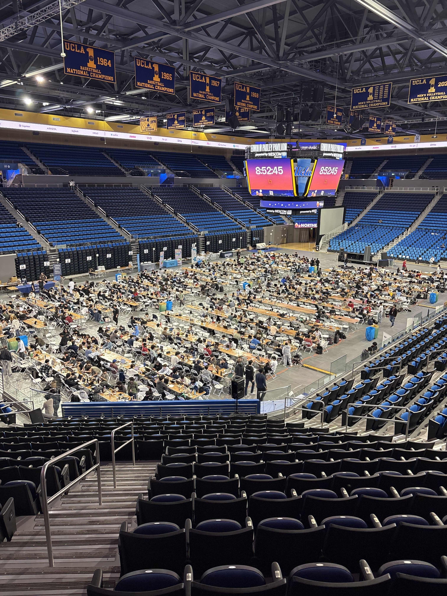

# My Experience at LAHacks 2026
## A Math/Econ major participates in his first hackathon

#### Contents

* [What is LAHacks and what was I doing there?](#ch1.1)
* [Our team, Roblox, and jamming together](#ch1.2)
* [Overall experience and vibes](#ch1.3)

### What is LAHacks and what was I doing there?  

**Hackathons** are popular events among engineers, designers, developers, and virtually anyone, where thousands of students gather for 24-72 hours to bring project ideas from ideation to pitchable projects. They typically feature many speakers from multiple industries, swarms of people on their laptops coding away on the floor, snack wrappers lying everywhere, and lots of energy drinks. At the end, judges come and evaluate each group’s project. Many awards are given across several categories, from “Best Use of X Tool” to “Most Questionable Use of 36 Hours”.

LAHacks is a hackathon hosted by UCLA and is the largest one in the Southern California region. People flew in from Berkeley, San Diego, and even Georgia Tech, just to compete and build something with others. Companies like Roblox, Figma, and fetch.ai were all sponsors. The event was 36 hours of nonstop coding. Speakers came in and talked about pitching startups, the world of FinTech, and more. It was wild.

But I study economics. The study of people making decisions and interactions among agents in society. A hackathon is generally not in an economist’s job description. But nonetheless, it was my final year at UCLA, so this past weekend, I too put on my vibe-coding hat and stepped foot into Pauley Pavilion, the home of LAHacks.

### Our team, Claude, Roblox, and [HEALING] Jam Together As One

I didn’t step in alone. I teamed up with Peg and Pelivan (CS majors), as well as Lily (neuro major). Our mission? Develop the best Roblox game designed to promote mental wellness and coming together as one.

The problem? I had no idea where to start. In fact, I didn’t even have a Roblox account. The first night, I was tasked with producing some background lo-fi music for our game, for which I had no concept yet. But, as an economist, we are trained to internalize our expectations. Needless to say, they weren’t high.

I first started by trying to link up Claude Desktop to Roblox Studio through an MCP server. This allowed me to literally prompt Claude through text, while Claude had access to our Roblox Studio environment and could edit it accordingly. I could type something like:

> Design a fishing dock positioned next to the stage. Make it so there is a proximity prompt that activates a fishing game for the player. Have the player wait until a fish is on the line, and when the fish comes, have them spam the space bar in order to catch the fish. Reward them with coins for certain fish caught, with higher rewards for rarer fish.

In a couple of minutes, I would see the newly generated dock in the game, and when I tested it, I could indeed spam the space bar and start catching fish! I quickly capitalized on my new powers and designed a matcha shop that rewarded players with “wellness points”, a firepit that could let players roast marshmallows, and a corn farm–a tribute to Illinois.

Roblox game dev is much harder than it looks. Thankfully, with AI tools, navigating this complex space was no longer the bottleneck; the bottleneck was what your vision was. Our final product was [**[Healing] Jam Together As One**](https://devpost.com/software/healing-jam-together-as-one?ref_content=user-portfolio&ref_feature=in_progress){target="_blank"}, an interactive multiplayer experience where players are transported to a serene, forested island, pick up instruments, join a band, and participate in group activities to improve mental well-being. It’s actually currently published in Roblox, so give it a try if you want a (very buggy) experience XD

I would say that the biggest killer of hackathon groups is group members’ optimism or pessimism for the project. On Saturday, the day before the submission was due, there was a lull in our progress. But we managed to pull through closer to the evening, pumping out a rhythm game feature, in-game instrument sound effects, more song levels, and much more.

As the clock hit 2 AM, we decided to start filming our demo video. Hackathons move quickly; teams must start an idea, code a minimum working product, film a demo video, and push their project to DevPost, all within 36 hours. We began filming ourselves walking through the events, but we ran into some technical difficulties when some of our screen captures stopped working. A couple of stressful recordings later, we finally got the footage by 3 AM. Peg stayed up the whole night to edit our demo video, which you can take a look at [here](https://devpost.com/software/healing-jam-together-as-one?ref_content=user-portfolio&ref_feature=in_progress){target="_blank"}.

But the hackathon wasn’t over. In fact, after the 36-hour coding period, teams must now pitch their products to a group of 9-10 judges over the course of 2-3 hours. Judges from all backgrounds come and evaluate your product on design, applicability, and other track-specific elements. It’s extremely fast-paced; we only had 3-5 minutes to show what we had been working on for the past day and a half, sometimes to people who were just hearing of Roblox for the first time. By the end of the presentations, we were worn out and rewarded ourselves with some lunch at Rendezvous.

Finally, the award presentations came. We were mainly gunning for one track: the Roblox track. They were giving out around $5,000 in total awards, but there were around 25 other Roblox projects competing with us (among the ~300 projects total submitted). The odds weren’t good, but since the judging process was so variable, we still had our hopes up.

Unfortunately, we didn’t end up winning anything. Although disappointing, it was easy to reflect on how much this experience gave me value besides an award; the fact that we could be disappointed about not winning when we had no expectations of winning to start speaks volumes. I came into my first hackathon with the only goal of seeing what it was really all about. I definitely got that and much more. Read on below.

### Overall experience and vibes

LAHacks was a super fun experience, and I’m so happy I managed to see it to the end with a group of friends. From lettuce-eating competitions to 11 PM matcha popups to poker and karaoke nights to free Panda Express and Emporium Thai food to proving that I was a human in front of some orb to get free boba to seeing people who flew in from across the country sleeping in sleeping bags at the school I go to–this embodied the hackathon spirit.

It was especially valuable to see what people were getting excited about and the winning ideas. As academic economists, it’s easy to bury yourself in a niche. Yet oftentimes, the best ideas often come about from serendipitous interactions with other people. Building your own opinions on some of the pressing issues in technology and society, seeing what the world has come to within the tech sphere, experimenting with AI workflows, and learning about the potential use cases of new technology gave me a lot of ideas on how to implement these tools and ideas into my own research pipelines in the future.

On the other hand, hackathons prioritize fast-paced implementation, effective communication, and compelling presentation. These skills are valuable in industry, and they help explain why AI-assisted workflows have become so widely adopted. During the hackathon, once teams exhausted their Claude tokens, they quickly moved to Gemini, Codex, and other tools in an effort to accomplish as much as possible within a short timeframe. While this behavior is well suited to rapid prototyping, it can be detrimental in research, where results, assumptions, and problem formulations must be rigorously verified. AI can generate many outputs that appear impressive on the surface, but our ability to verify those outputs has not scaled at the same pace. At this crucial stage of AI adoption, it is important to distinguish between production and understanding. One can produce a great deal quickly without deeply understanding the fundamentals; conversely, one can understand the fundamentals deeply while still requiring a long time to make a meaningful contribution to a field. I believe this distinction may become a defining difference between industry and academia, and it will be interesting to see how academics adapt to the new economies of scale created by AI.

Overall, LAHacks was a great experience. These events really are for everyone. If you have a vision, the only bottleneck is how much you are willing to go and execute it.

