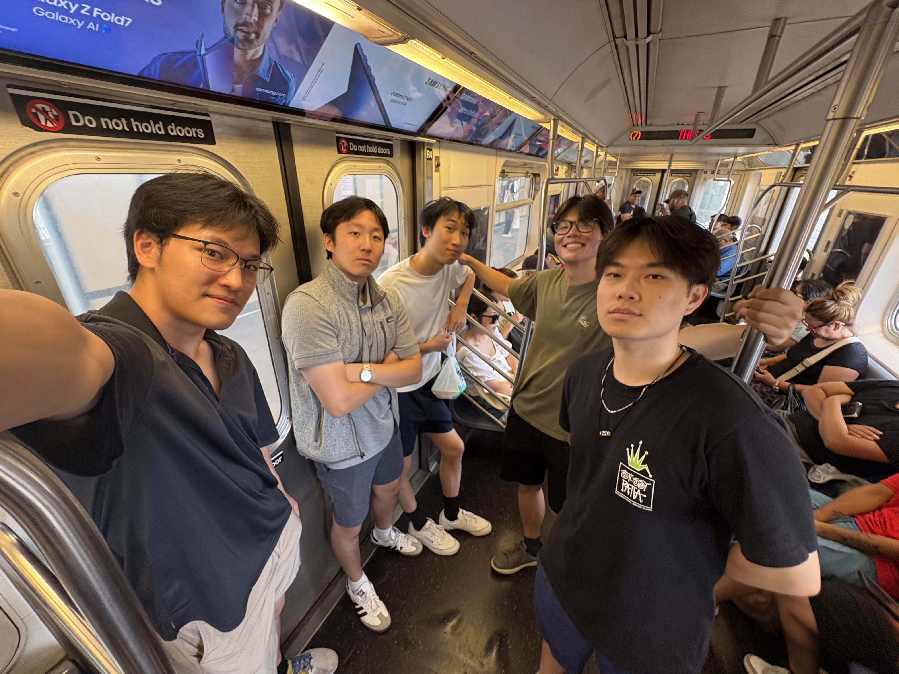
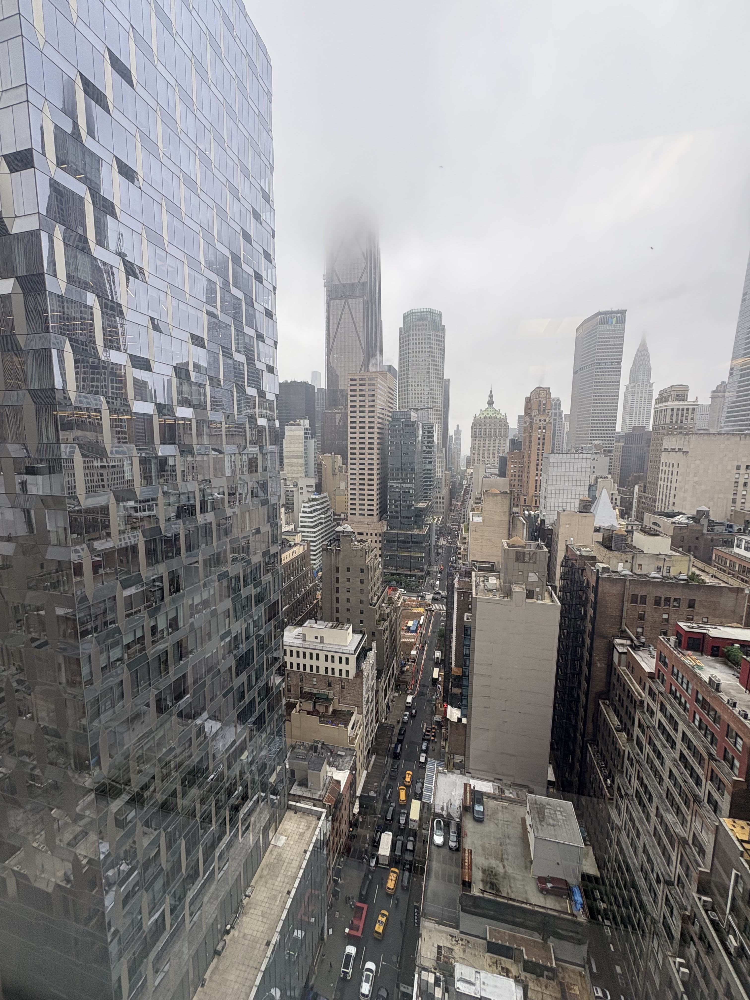

# NERA Economic Consulting and New York City
## Summer 2025

#### Contents

* [Interning at NERA](#ch1)
	* [What is Economic Consulting?](#ch1.1)
	* [Work in Securities and Finance](#ch1.2)
	* [The People and Culture](#ch1.3)

### Interning at NERA 

Hi lovely reader! Thanks for visiting :) As an economics student, I had my "canonical" New York internship this summer, and I was fortunate enough to have this experience at NERA Economic Consulting.

**What is Economic Consulting?** 

When you hear about "consulting", most students would think of names like McKinsey or Bain-- the premier management consultancies. These firms provide services and advice to businesses on how to maximize profits or run operations (of course, their effectiveness is up to debate XD). *Economic* consulting at firms like NERA, Cornerstone, or Analysis Group is a more niche practice. As the name suggests, economic consultants specialize in applications of economics in many different areas, from litigation consulting (helping advise clients in lawsuits) to procurement auctions (such as for allocating energy sources or radio frequencies). As an economics student, you typically learn about concepts like "imperfect competition" in your micro theory class or "counterfactuals" in your metrics class, but in many jobs, you won't necessarily need to understand these. Economic consulting is different, in that you get to actually see some of these theories in action with real life cases and data.

One of the more popular cases economic consulting firms get are *antitrust* cases. For example, economic consultants might be hired to assess whether firms in some industry were colluding to inflate prices, using models from oligopolistic competition. When two firms combine in a merger or acquistion, economic consultants may also act as advisors on the deal, being experts on antitrust law. Another typical case econ consulting firms might receive is a *securities litigation*, such as a class action lawsuit (10b-5). These are really common, as one usually always shows up whenever a stock experiences a large drop in share price and shareholders sue the company for violating some agreement. Economic consultants are hired to run counterfactual analyses, assess for potential causes of the stock price drop, and use regressions to estimate damages and payouts to shareholders.

Overall, it's more "quantitative" than other forms of consulting, in the sense that econ consultants work with large datasets and statistical tools almost daily, but I'd say it's still digestible for most economics majors who've taken some econometrics classes. It's also fun to see some of the theory you learned in the classroom peeking through sometimes, and gives a lot of insight into potential case studies or research topics in finance or industrial organization. For this reason, many academics and professors often collaborate externally with economic consultancies as well, acting as expert witnesses or advisors.

**Work in Securities and Finance** 

I was part of (one of) the Securities and Finance team in New York, which was the largest practice at NERA. As mentioned before, shareholders are usually always pretty litigious, so there's rarely a shortage of class actions, derivative disputes, market manipulation suits, or anything of that sort. 

As an intern, most of my work involved data entry, research/literature review, and making the occasional chart of some neat looking overlayed stock prices. But I did get to be involved in some pretty interesting and large cases during my ten weeks. While litigation work is highly confidential, some cases involved some financial mathematics such as misused correlation models, others had us looking for flaws in a counterparty's statistical analysis. We also got some 10b-5 class actions on some familiar-face companies, which was always fun to see, and I got to work with some the internal regression tools economic consultants used to calculate and estimate damages.

On the research side, one of my tasks was analyzing IPO and SPAC data. I researched policies and regulations around their trading and lockup periods, and experimented with machine learning models and backtesting trading strategies to identify trading windows. I also helped update some of the internal tools for webscraping with Python and automating the conversion of news outputs into structured tables. 

**The People and Culture** 

Moving to New York to work my first corporate job was definitely a big adjustment. The first mention of "casual Fridays" and bumbling my way around Excel (I'm a math major, okay?) in the first week got me wondering what the next nine would be like. 

But I got to meet a lot of smart people who were all into economics and its applications. In particular, our manager, Dr. Milev, was incredibly invested in the growth of the younger team members, and would often assign research tasks to the interns and bring us into external meetings. He brought us on a tour of the Yale Club, where we got to eat lunch at the rooftop restaurant and learn about Dr. Milev's time at NERA. The rest of my team were also incredibly down-to-earth people and were always willing to lend a helping hand. A core memory is when we went to Mitr Thai (highly recommend) for a team dinner to welcome the new hires, and we all competed in a game of trivia.

Some of my favorite memories were eating lunch with all the other interns every day. The Marsh McClennan cafeteria was great, and the team would also cater in lunch from a new restaurant two times every week. Learning about the tasks other interns on other teams were working on or what their interests were back at school was really fun and made living in New York alone feel less lonely.

In summary, I enjoyed my time at NERA! I'm grateful to everyone for a fulfilling summer.

(Apparently, I also tied the NERA intern record for eating eight hot dogs at the Yankees game.)

