# ECON 102: Macroeconomic Theory - Solow Model Assignment
## Fall 2025, C. Surro

In this assignment, we model macroeconomic growth using the [Solow model](https://en.wikipedia.org/wiki/Solow%E2%80%93Swan_model){target="_blank"} and Excel. 

<a href="../../resources/classes/econ-102/Solow Model Assignment.xlsx" download>Download Excel Data and Charts</a>

The Solow model assumes three possible sources of growth: capital ($K$), labor ($L$), and technology/total factor productivity/TFP ($A$). Output ($Y$) is given by a constant returns-to-scale production function (we use Cobb-Douglas)
$$ Y = F(K,L) = AK^\alpha L^{1-\alpha} $$
where $\alpha \in (0,1)$. The economy is also assumed to save a fixed fraction of this output as "investment", given by $s \in [0,1]$. The economy evolves according to the assumed "law of motion", which is:
$$ K_{t+1} = sF(K_t, L) + (1-\delta)K_t $$
where $\delta \in (0,1)$ is a depreciation constant. Finally, the growth of labor and TFP are exogeneous to the model, with growth rates of $\eta > 0$ and $\gamma > 0$, respectively. 

For this assignment, we initialize the following values for the model:

* Capital Share of Income ($\alpha$): $0.2$
* Saving Rate ($s$): $0.6$
* Depreciation Rate ($\delta$): $0.02$
* Population Growth Rate ($\eta$): $0.05$
* TFP Growth Rate ($\gamma$): $0.07$
* Adjusted TFP Growth Rate ($\widetilde{\gamma} = \gamma/(1-\alpha)$): $0.0875$

We can write the production function in "per-effective worker terms" as such:
$$ \widetilde{y} = f(\widetilde{k}) = \widetilde{k}^{\alpha} $$
where $\widetilde{k} = \frac{K}{\widetilde{A}L}$ and $\widetilde{A} = A^{1/(1-\alpha)}$, and $\widetilde{y}$ is defined similarly. Furthermore, adding in the growth rates of $L$ and $\widetilde{A}$, we get the law of motion:
$$ (1+\widetilde{\gamma}+\eta)\widetilde{k}_{t+1} = sf(\widetilde{k}_t) + (1-\delta)\widetilde{k}_t.$$

A steady state level of capital per effective worker is given by a $\bar{k}$ such that when inputted into the law of motion, the same level of capital per effective worker is returned. We compute the steady state:
$$\bar{k} = \left(\frac{0.6}{0.02+0.05+0.0875}\right)^{\frac{1}{1-0.2}} = 5.322. $$
Plugging this into the production function, we get that the steady output per effective worker is $\bar{y} = 1.3971$. Finally, solving for steady-state consumption we get, $\bar{c} = (1-s)\bar{y} = 0.5588$. 

Now, we model the evolution to this steady state starting from some initial values. We initialize $\widetilde{A}_0 = 1, L_0 = 1000, \widetilde{k}_0 = 2.661$. Using the law of motion, we calculate the capital per effective worker, (log) capital per worker ($k = K/L = \widetilde{k}\widetilde{A}$), and (log) aggregate capital ($K$) for $100$ periods. 

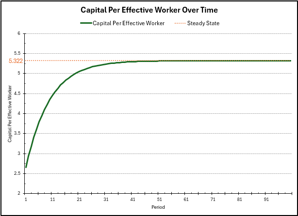

In the plot above, we can see the capital per effective worker converge over time towards the steady state $5.322$ we calculated before. This increase occurs at a large rate at first because the level of capital is far below the steady state, so investment at this level is much greater than the level of depreciation. However, as the level of capital approaches the steady state, these two forces start to become equal in magnitude (since production has diminishing returns to capital), slowing down the growth of capital *per effective worker* to $0$. 

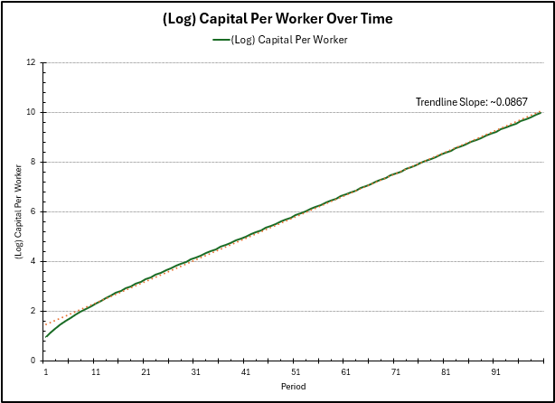

In this plot, we see the growth of capital per worker over time. As we approach the steady state of capital per effective worker, the growth rate of $\widetilde{k}$ slows down to zero. However, capital per worker $k = \widetilde{k}\widetilde{A}$. Since $\widetilde{A}$ grows at rate $\widetilde{\gamma} = 0.0875$, so will $k$. We see this convergence in growth rate in the graph above (using the difference in log values as an approximation of the growth rate), with a larger growth rate in the beginning (as $\widetilde{k}$ is still growing then).

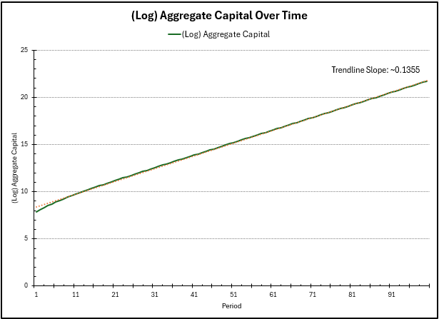

Finally, for the aggregate capital $K$, this is $K = \widetilde{k}\widetilde{A}L$. As before, at steady state, $\widetilde{k}$ as $0$ growth, $\widetilde{A}$ has $0.0875$ growth, and $L$ has $\eta = 0.05$ growth, for an approximate total growth rate of $0.1375$, which we see $K$ converge to. There is again a larger growth rate in the beginning as $\widetilde{k}$ is still growing.

As a note, the capital per effective worker experiences zero growth rate at the steady state, but the values we can interpret and care about (i.e. capital per worker and aggregate capital) continue to experience growth from $\gamma$ and $\eta$ (TFP and population growth).

We can visualize the growth rates of $k$ and $K$ over time in the following figure, seeing the convergence of the growth rates to the values mentioned before. They start out larger, but converge to the previous values as we reach the steady state capital per effective worker.

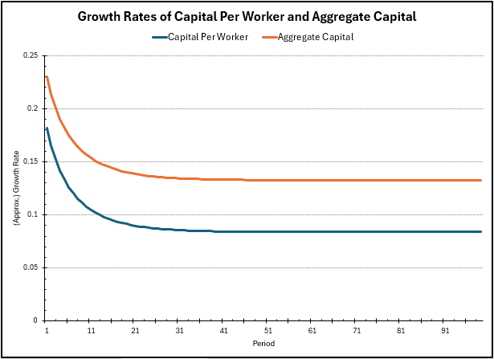

### Maximizing consumption, shock to savings

In an economy, we don't seek to maximize level of output or capital per se, but available consumption to workers (which contributes to their utility). The consumption per worker $c$ is given by $(1-s)y$, where $y$ is the output per worker, and intuitively, captures all the output which is *not* invested. The idea is to pick a savings rate $s$ such that $c$ is maximized. More saving could increase investment and output, but decrease consumption explicitly, however, less saving could increase consumption explicitly but decrease output over time.

The consumption maximizing condition is given by $f'(\widetilde{k}) = \delta + \eta + \widetilde{\gamma}$, and plugging this into the law of motion to solve for steady state, we get that the optimal savings rate should be $s = \alpha = 0.2$. In the following charts, we model the evolution of the economy, starting from the previous savings rate of $0.6$ to the lower savings rate of $0.2$. We run the law of motion for $100$ more periods, and plot the time frame from period $50$ to period $200$.

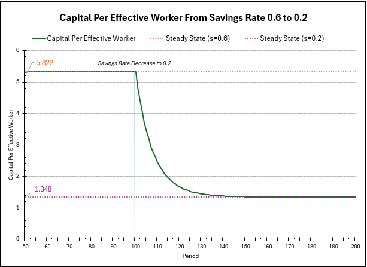

In this chart, we can see the change in capital per effective worker over time. Before, the steady state was $5.322$, however, computing the new steady state with $s=0.2$, we see:
$$ \bar{k} = \left(\frac{0.2}{0.02+0.05+0.0875}\right)^{\frac{1}{1-0.2}} = 1.348. $$
The steady state has decreased since we are saving, and thus, investing less, meaning we can only maintain a smaller level of capital per effective worker. As before, right after the change, the level of capital per effective worker is much higher than the steady state level, so the convergence to steady state is fast, but as the level of capital decreases, the investment starts to match the depreciation, so growth converges to $0$. 

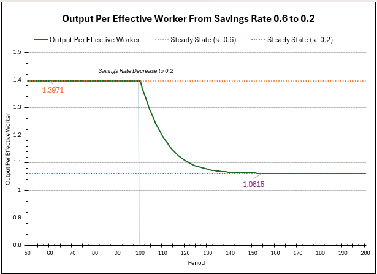

A similar story is told in the above chart here, which shows the evolution of output per effective worker over time. Previously the steady state output was $\bar{y} = 1.3971$, but computing the new steady state output, we get $1.348^{0.2} = 1.0615$. The intuition remains the same as before; we are investing less, so we can maintain only a smaller level of output per effective worker. The decline is fast in the beginning as depreciation is much larger than investment, but slows to a rate of $0$ as these forces even out.

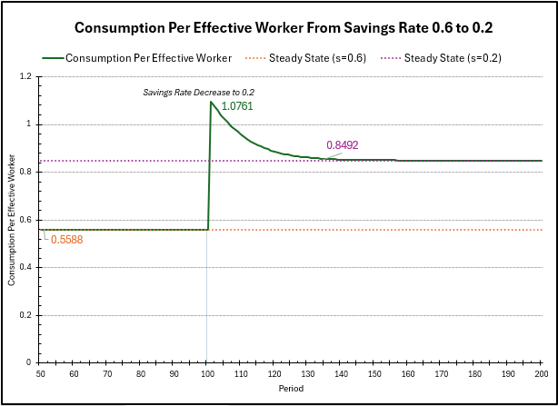

Finally, we plot the consumption per effective worker over time. Before, the steady state consumption was $0.5588$. Decreasing the savings rate to $0.2$ will result in an immediate increase in consumption, as the output will not change as quickly, but the spending factor in consumption will increase significantly immediately. We can compute this $c_{t=101} = (1-0.2)\bar{y}_{\text{before}} \sim 1.1176$, which is close to the value in the graph (which uses the output level at $t=101$, so it has decreased slightly from the steady state before). 

However, the output per effective worker, as shown in the previous graph, will steadily decline over time to the steady state of $1.0615$, so consumption will decrease accordingly too. Calculating the new steady state consumption, we get $\bar{c} = (1-0.2)1.0615 = 0.8492$. As expected, this is higher than the consumption level previously ($0.5588$). 

### An upward shock to TFP growth, $\widetilde{\gamma}$

For this last exercise, we double the adjusted TFP growth from from $\widetilde{\gamma} = 0.0875$ to $0.175$, start back from period $t=100$, and model the evolution of the economy (the capital per effective worker, capital per worker, and aggregate capital) for $100$ more periods. 

First, we calculate the new steady state of capital per effective worker, given by
$$\bar{k} = \left(\frac{0.6}{0.02+0.05+0.175}\right)^{\frac{1}{1-0.2}} = 3.0636. $$
While we increased the total factor productivity growth rate, the steady state of capital per *effective* worker decreased, because $\widetilde{\gamma}$ is essentially treated similarly to an increase in depreciation. We can only maintain a lower level of capital per effective worker, since technology is growing faster. 

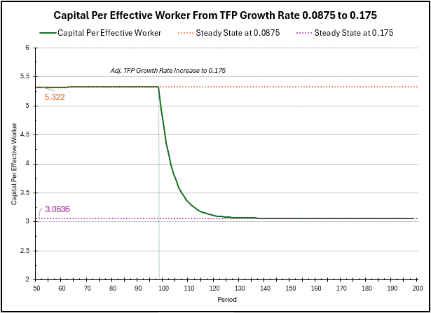

In the chart above, we see the evolution of $\widetilde{k}$ over time after the change in $\widetilde{\gamma}$, from the previous steady state to the new steady state. As before, when the level of capital per effective worker is far above the steady state, depreciation overtakes investment, and $\widetilde{k}$ decreases fast. However, as $\widetilde{k}$ approaches the new steady state $3.0636$, these forces even, and the growth rate slows to $0$.

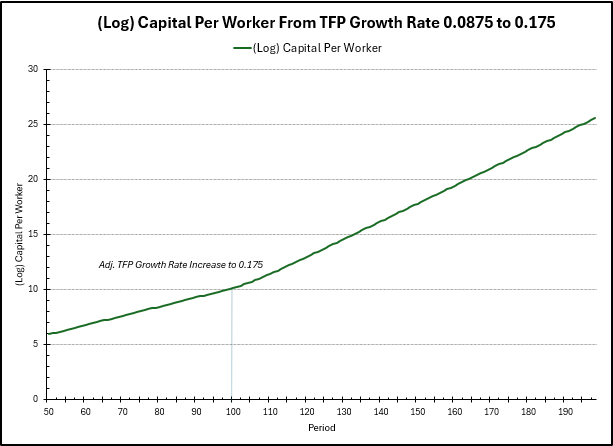

In the plot above, we plot (log) capital per worker over time. Before the change, the graph has an approximate slope of $0.0875$, due to the growth rate of $\widetilde{A}$ before. However, after the shock to $\widetilde{\gamma}$, the slope increased to approximately $0.175$, so $k$ is in fact growing at a faster rate than before. $k$ is more interpretable than $\widetilde{k}$, so here we see the actual "positive" effect of the increase in productivity.

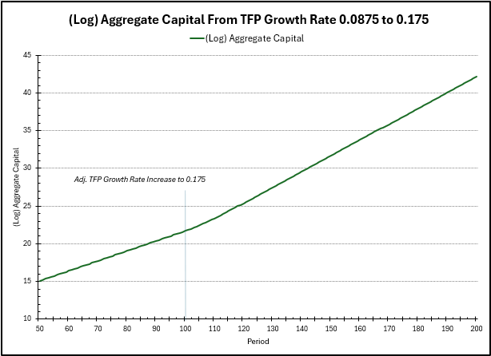

Finally, in the above, we plot the (log) aggregate capital over time. As mentioned previously, this just also incorporates the growth rate of $L$ ($\eta = 0.05$). Before, the growth rate (slope) was approximately $\widetilde{\gamma} + \eta = 0.0875 + 0.05 = 0.1375$, but after the shock to productivity, the new growth rate is $0.175 + 0.05 = 0.225$, so aggregate capital's growth rate has also increased.

Below is the graph of the growth rates of $k$ and $K$ over time, which illustrate the developments mentioned before. The growth rates begin at their before levels, then steadily rise up to their new levels before remaining constant (once $\widetilde{k}$ has reached steady state and is no longer experiencing growth).

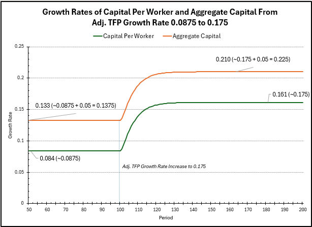

Thanks for reading!

