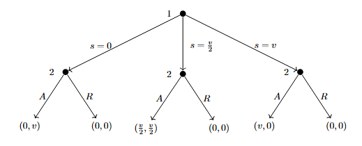
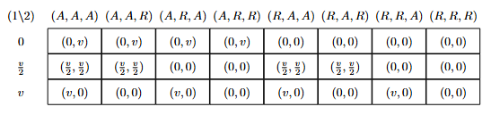

# ECON 201B - Microeconomic Theory: Basic Concepts and Techniques of Noncooperative Game Theory and Information Economics
## Winter 2026, Tomasz Sadzik

This is the second course in the PhD microeconomics sequence at UCLA. The topics covered are static games, Nash equilibrium concepts, dynamic games, and applications (Bertrand, Cournot, Hotelling, auctions, Stackelberg, bargaining, reputation, signaling, cheap talk). We follow loosely Mas-Colell, Whinston, and Green. Please let me know at [kennyguo@ucla.edu](mailto:kennyguo@ucla.edu) if you spot any errors. Thanks!

#### Problem Set Solutions:
* [Problem Set 1 (games, strategies, rationalizability)](#hw1)
* [Problem Set 2 (weak dominance, nash equilibria, mixed NE)](#hw2)
* [Problem Set 3 (bayesian games and auctions, global games)](#hw3)
* [Problem Set 4 (dynamic games, SPNE, bargaining)](#hw4)
* [Problem Set 5 (repeated games, PPE/APS method, imperfect monitoring)](#hw5)

## Problem Set 1: Games, Strategies, and Rationalizability 

> 1. **Ultimatum Game.** Consider the following game. Two players, 1 and 2, bargain to determine the split of $v$. Bargaining works as follows. Player 1 offers a split, $s$, which must take one of the following three values: $0$, $v/2$, or $v$. Player 2 observes this offer, and either accepts or rejects it. If 2 accepts the offer, 1 gets a payoff of $s$, and 2 gets a payoff of $v-s$. If 2 rejects the offer, both players get $0$, and the game ends.
> a) Draw the extensive form of this game.
> b) Determine the strategy sets for each player in this game.
> c) Draw the normal form for this game.
> d) Identify any strictly dominated strategies. What is left after iterative deletion of strictly dominated strategies?

  
*Answer.*

a) Let $A$, $R$ represent Accept and Reject. The extensive form tree is given below.

b) The strategy set for player 1 is $S_1 = \{0, v/2, v\}$. The strategy set for player 2 is conditional on that of 1: $S_2 = \{(X\mid0, Y\mid\frac{v}{2}, Z\mid v) \, : \, X,Y,Z \in \{A, R\}\}$. Expanded out fully and omitting conditional notation, we have
$$ S_2 = \{(A,A,A), (A,A,R), (A, R, A), (A, R, R), (R, A, A), (R, A, R), (R, R, A), (R, R, R)\}.$$

c) The normal form game matrix is given below.

d) No strategy of Player 1 is strictly dominated (e.g. fix Player 2's strategy to $(A,R,R)$. No mixture of the other two strategies has strictly greater payoff than the third for Player 1, as they are all $0$). Likewise, no strategy of Player 2 is strictly dominated (e.g. fix Player 1's strategy to $v$. All strategies give payoff of $0$ for Player 2). Thus, the entire strategy profile of both players is left after IDSDS.

> 2. **Cournot Limit.** Recall that we claimed the linear Cournot game with 2 firms is dominance solvable. Given that the $1$-rationalizable set is $[0, \gamma(0)]$, the $2$-rationalizable set is $[\gamma^2(0), \gamma(0)]$, the $2$-rationalizable set is $[\gamma^2(0), \gamma^3(0)]$, etc., prove that this converges to a point. Compute what this limit is.

  
*Proof.*

Recall the linear Cournot game is given by
    \begin{align*}
        q &= q_1 + q_2, \\
        p(q) &= a - bq, \, a, b \geq 0, \\
        c_i(q_i) &= cq_i, \, i = 1,2, \, c \geq 0,
    \end{align*}
    utilities are given by profit, and where $q_1, q_2 \geq 0$, $b \neq 0$. The best-response function $\gamma$ for both firms is then given by 
    $$
    \gamma(q_{-i}) = \max\left\{\frac{a-c}{2b}-\frac{q_{-i}}{2}, 0\right\}
    $$
    It can be shown that if $q_{-i} \in [\underline{q}, \overline{q}]$, then all $q_i < \gamma(\overline{q})$ and all $q_i > \gamma(\underline{q})$ are strictly dominated. With this fact, we see how the strategy sets (which start as $[0, \infty)$) for both players follow the sequence above. Observe that the lower bounds follow the subsequence $(\gamma^{(2t)}(0))_{t\geq 0}$ while the upper bounds follow the subsequence $(\gamma^{(2t + 1)}(0))_{t\geq 0}$. Without loss of generality, assume $a-c > 0$ (if not, the strategy sets trivially converge to $\{0\}$). We then note that
    $$
    \gamma^{(t)}(0) = -\left(\frac{a-c}{b}\right)\sum_{s=1}^t\left(-\frac{1}{2}\right)^s
    $$
    which converges as $t \rightarrow \infty$ by the alternating series test. Thus, the limit is unique, meaning $\lim_t \gamma^{(t)}(0) = \lim_t \gamma^{(2t)}(0) = \lim_t \gamma^{(2t + 1)}(0)$. The strategy sets become singletons after IDSDS, so the game is dominance-solvable. Computing this limit, we find:
    \begin{align*}
        \underset{t\rightarrow \infty}{\lim} \gamma^{(t)}(0) &= -\left(\frac{a-c}{b}\right) \sum_{s=1}^\infty \left(-\frac{1}{2}\right)^s \\
        &= -\left(\frac{a-c}{b}\right)\sum_{u=1}^\infty \left(-\frac{1}{2}\right)^{2u-1}+\left(-\frac{1}{2}\right)^{2u} \\
        &= -\left(\frac{a-c}{b}\right)\sum_{u=1}^\infty -\frac{2}{2^{2u}} +\frac{1}{2^{2u}} \\
        &= \left(\frac{a-c}{b}\right)\sum_{u=1}^\infty \frac{1}{4^{u}} = \boxed{\left(\frac{a-c}{3b}\right)}
    \end{align*}

> 3. **Asset Bubble.** Imagine a game with $I$ investors, each of whom owns one unit of stock. Each of them bought it at time zero, for zero dollars (which is a normalization). The value of the asset keeps rising one dollar per day. The strategy of each investor $i \leq 100$ is to pick a day in the set $\{1, 2, \ldots, 100\}$ when $i$ sells the asset. We will model this as a Normal form game (each investor makes the decision at time zero, leave the instructions to an associate, and leaves for long holidays). 
> The price of the asset works as follows. If $n$ is the first day when anyone sells the asset, the price this day will be $n$ divided by the number of traders that chose to sell that day. Each day afterwards, the asset price is zero.
> Finally, and investor incurs a cost of holding the asset. The total cost is $\varepsilon > 0$ times the day at which the investor sells the asset.
> The payoff to investor $i$ is the price at which $i$ sold the asset minus the cost of holding the asset.
> a) Show which strategies for an investor are dominated.
> b) Find the set of rationalizable strategies for an investor.

  
*Answer.*

a) Suppose investor $i$ sells on day $100$. If everyone else sells on day $100$, $i$'s payoff is $100/I - 100\varepsilon$. If the others follow any other joint strategy (i.e. there is at least one investor that sells before day $100$), $i$'s payoff is $-100\varepsilon$. Now, consider investor $i$ selling on day $99$. If everyone sells on day $100$, $i$'s payoff is $99 - 99\varepsilon$, which is strictly greater than before (assuming $I \geq 2$). With the other investors following any other joint strategy, $i$'s payoff is \emph{at least} $-99\varepsilon$, which is strictly greater than $-100\varepsilon$. Thus, selling on day $100$ is dominated by selling on day $99$. Note that we can only eliminate day $100$ from the $1$-rationalizable set. For example, if $2 \leq n < 100$, then a joint opponent strategy which would break the dominance of selling on $n-1$ over selling on $n$ would be all other investors selling on day $100$ (assuming $\varepsilon$ is small). 

b) However, continuing the process of IDSDS, we can continue to eliminate the last day of selling from our rationalizable sets. This means this game is dominance-solvable, resulting in the unique singleton rationalizable strategy of all players which is to sell immediately on day $1$.

> 4. **Bertrand with Differentiated Products.** Consider the following Bertrand competition with differentiated products. There are two firms in the industry. Each chooses a positive price for its product, and demand for product $i$ as the function of the two prices is $q_i = A - Bp_i + Cp_j$, where $A,B \geq 0$ and $C \in \mathbb{R}$ (if $C>0$, $i$ and $j$ are substitutes, and if $C <0$, they are complements, with the magnitude representing the strength of the relationship). The costs of each firm are normalized to zero, so the payoffs are the revenues. The action set of each firm is a set of prices in $[0, M]$. 
> a) For fixed $A, B$, describe the set of strategies that are not dominated, as a function of $C$. 
> b) For fixed $A, B$, describe the set of strategies that survive the process of IDSDS, as a function of $C$.

  
*Answer.*

a) The utility of firm $i$ is given by $u_i(p_i, p_j) = Ap_i - Bp_i^2 + Cp_ip_j$. Fixing a $p_j$, we use the FOC to find the best-response function $p_i^\star(p_j) = \frac{A}{2B} + \frac{Cp_j}{2B}$. Since the strategy set of $j$ is $[0,M]$, this means the set of strategies that are not dominated for $i$ is $[\frac{A}{2B}, \frac{A}{2B} + \frac{CM}{2B}]\cap[0,M]$ if $C > 0$, or $[\frac{A}{2B} + \frac{CM}{2B}, \frac{A}{2B}]\cap[0,M]$ if $C < 0$.

b) We consider three cases:

Case 1: $\frac{C}{2B} \geq 1$. Continuing the IDSDS using the best-response function, we have the upper bound of the rationalizable set is $M$, while the lower bound follows the diverging sequence $\left(\frac{A}{2B}\sum_{s=0}^t\left(\frac{C}{2B}\right)^s\right)_{t \geq 0}$. Since the strategy set is bounded by $M$, the unique rationalizable strategy is $M$ for both firms.

Case 2: $\frac{C}{2B} \leq -1$. Using (a) ($C <0$), it holds that the 1-rationalizable set is $[0, \frac{A}{2B}]$. Iterating again with the best response function yields the same interval, so the set of rationalizable strategies is $[0, \frac{A}{2B}]$. 

Case 3: $1 > \frac{C}{2B} > -1$. If $I_k = [\underline{i_k}, \overline{i_k}] \cap [0,M]$ is the interval after the $k$-th deletion, then $I_{k+1} = [\frac{A}{2B} + \frac{C\underline{i_k}}{2B}, \frac{A}{2B} + \frac{C\overline{i_k}}{2B}] \cap [0,M]$. Computing the length of the untruncated $I_{k+1}$, we get:
$$
\left|\frac{A}{2B} + \frac{C\overline{i_k}}{2B} - \frac{A}{2B} - \frac{C\underline{i_k}}{2B}\right| = |\frac{C}{2B}||\overline{i_k} - \underline{i_k}| < |\overline{i_k} - \underline{i_k}|
$$
so the interval strictly decreases in length, and thus converges to a point. This point must be a fixed point of the best response function, i.e.
$$
p_i = \frac{A}{2B} + \frac{Cp_i}{2B} \,\,\,\,\,\, \text{which gives} \,\,\,\,\,\, p_i = \frac{A}{2B-C}.
$$
Since $C < 2B$, this point is always positive, but can extend beyond the bound of $M$. Thus, the unique rationalizable price for both firms is
$$
\min\left\{\frac{A}{2B-C}, M\right\}.
$$

## Problem Set 2: Weak Dominance, Nash Equilibria, Mixed Nash Equilibria 

> 1. **A Game.** Consider the following game in normal form, where Player 1 chooses rows and Player 2 chooses columns. In each cell, 1’s payoff is listed first and 2’s payoff second.
> $$\begin{array}{c|ccccc} & a & b & c & d & e \\ \hline A & (2,1) & (4,2) & (1,0) & (10,3) & (2,4) \\ B & (6,10) & (2,20) & (0,10) & (7,15) & (0,18) \\ C & (5,0) & (0,0) & (3,3) & (5,0) & (0,1) \\ D & (8,1) & (2,4) & (0,0) & (5,1) & (4,2) \\ E & (1,3) & (2,6) & (0,4) & (8,5) & (1,3) \end{array} $$
> a) Does either player have strictly dominated strategies? If so, what are they? Does either player have weakly dominated strategies? If so, what are they?
> b) What strategies are eliminated through iterative deletion of strictly dominated strategies? Is the game dominance solvable?
> c) Completely characterize the set of pure-strategy Nash equilibria for this game.
> d) Completely characterize the set of rationalizable strategies for this game.

  
*Answer.*

a) For player 1: $E$ is strictly dominated by $A$. For player 2, $a$ is strictly dominated by $0.75(b) + 0.25(c)$. Besides the strictly dominated strategies, there are no additional weakly dominated strategies for either player.

b) After IDSDS, we have $S_1'=\{A, C, D\}$ and $S_2' = \{b,c,e\}$. $d$ becomes strictly dominated after we eliminate $E$ from Player 1's set after the first round (it was originally a best-response to a mixed belief of $A$ and $E$). $B$ becomes strictly dominated after we eliminate $a$ from Player 2's set after the first round (it was originally a best-response to a mixed belief of $a$ and $d$).

c) There exists one unique pure strategy equilibrium: $(C, c)$. 

d) We have that a strategy is rationalizable if and only if it surives IDSDS. Thus, the rationalizable strategies are the ones listed in part (b). 

> 2. **Location Choice.** Consumers are uniformly distributed along a boardwalk of length 1 mile. The price of ice cream is fixed by a regulator, so consumers go to the nearest firm because they dislike walking (assume that at the regulated price all consumers will purchase an ice-cream cone even if they have to walk a full mile). If more than one vendor is at the same location, they evenly split the business.
> a) Consider a game where two ice-cream vendors pick their locations simultaneously. Show that there exists a unique pure-strategy Nash equilibrium.
> b) Show that with three vendors, no pure-strategy Nash equilibrium exists.

  
*Proof.*

a) Without loss of generality, let the two vendors be $A$ and $B$, let each of their strategy sets be $a,b \in [0,1]$ (the location they choose), assume price is one, and assume unit density of consumers (i.e. a region of length $x$ amounts to $x$ units of demand). We show that $(0.5, 0.5)$ in the unique NE. By symmetry, we only consider the case where $A$ deviates. If $a < 0.5$, then demand for $A$ falls to $a + (0.5-a)/2 < 0.5$, the demand at $(0.5, 0.5)$. Similarly, if $a > 0.5$, then demand for $A$ falls to $(1-a) + (a-0.5)/2 < 0.5$, the demand at $(0.5,0.5)$. Price is fixed, so any deviation yields strictly lower profit, meaning both vendors are best-responding to each other.

Now suppose there's another NE. 
* Case 1: $a \neq b$. Without loss of generality, assume $a < b$. Consider vendor $A$ and deviation $a' = (a + b)/2$. $A$ now captures $(a+b)/2 + ((a+b)/2 + b)/2$ demand, which is strictly greater than the $(a+b)/2$ demand before. Thus, $a \neq b$ cannot be a NE.
* Case 2: $a = b \neq 0.5$. Consider when $a = b > 0.5$ (the other case is analogous). Both vendors split the market and get $0.5$ demand each. Consider the deviation of $A$ to $a' = (a + 0.5)/2$. Now, $A$ captures $(a+0.5)/2 + ((a+0.5)/2 + b)/2$ demand, which is strictly greater than $0.5$ from before. Thus, Case 2 cannot be a NE.

b) Let the vendors be $A, B$, and $C$. Suppose that $(a, b, c)$ is a NE. We have the cases:
* Case 1: $a=b=c$. Thus, demand is split $1/3$ for each firm. If $A$ deviates towards $1/2$ (or if at $1/2$, away by a small amount $\varepsilon$), $A$ can capture demand greater than $1/3$, so not a NE.
* Case 2: $a,b \neq c$. Without loss of generality on the ordering of the players and the $>$ versus $<$, assume $a \leq b < c$. $C$ can thus move to $(b+c)/2$ and capture more demand, so not a NE.

These cases (when generalized) cover all potential pure strategy profiles, so no pure-strategy NE exists.

> 3. **Costly Bids.** Two risk-neutral firms, $i = 1,2$, produce a homogeneous product at a unit cost $c > 0$. There is a single consumer who buys either one unit of the good or nothing. The consumer has a reservation value $v > c$, and resolves indifference in favor of purchasing at price $p = v$.  
> 
> Suppose the firms simultaneously decide whether to announce prices $p_i \geq 0$. If a firm chooses to quote a price, it incurs a cost $k > 0$ (e.g., to pay a salesperson to visit the buyer), but it has the option not to quote a price (saving the cost $k$). Suppose $0 < k < v - c$.  
>
> The consumer buys the good at the lowest available price (provided it does not exceed $v$), and chooses between the firms with equal probabilities in the event of a tie.
> 
> a) Does this game have a pure-strategy Nash equilibrium? Justify your answer.
> b) Characterize the symmetric mixed-strategy Nash equilibrium.

  
*Answer.*

a) It doesn't. Suppose there exists some pure-strategy NE. We consider the cases:
* Case 1: Both firms quote a price. Both prices should be at least $c + k$ to cover for the cost of production and quoting, if their good is purchased. If one firm is priced differently from the other, the firm who's pricing lower has incentive to unilaterally raise by $\varepsilon$, still under the other firm's price, and claim strictly higher profit. If both firms set prices equal, but both strictly greater than $c+k$, then one firm has incentive to undercut by a very small $\varepsilon$, still above $c+k$, to claim the buyer's demand entirely, rather than face the coin toss. Finally, note that both firms pricing exactly at $c+k$ is not stable, because the expected profit would be negative (half chance consumer buys from them and they get 0 profit, half chance consumer doesn't and they pay $k$, so $(0.5)(c+k-c-k)+(0.5)(-k)$), and neither firm can undercut anymore without suffering negative profit, so a firm would want to unilaterally deviate to not quoting. Both firms would therefore have to set equally their prices at least at $c+2k$ to make the expected profit nonnegative, however, as stated before, one firm can then slightly undercut.
* Case 2: One firm quotes, the other doesn't. In this case, the quoting firm has a monopoly and can price their good at $v$ (which is strictly above $c+k$ by assumption). However, the non-quoting firm now has an incentive to quote at $v-\varepsilon$, still above $c+k$, giving strictly positive profit.
* Case 3: Both firms stay out of the market. Clearly, one firm has an incentive to quote at $v$ which has strictly positive profit.

Thus, there does not exist a pure strategy NE.

b) First note that a firm not quoting is chosen with positive probability, i.e. it is a best response to some other action. To see this, let $F(p)$ characterize the CDF of a firm over prices, given the firm quotes a price. If $p$ is high enough to where $F(p)$ is very close to $1$, the expected profit in a symmetric mixed NE, \emph{given both firms will quote}, is 
$$\underbrace{(1-F(p))}_{\mathbb{P} \text{ that you win}}\cdot (p-c) - k < 0,$$
which is strictly worse than not quoting (gives payoff of $0$). Thus, let $0 < q < 1$ be the probability a firm quotes a price.

We also note that the support of this CDF is from $[c+k, v]$. Pricing above $v$ would result in a strictly negative payoff ($-k$), and pricing below $c+k$ would result in a strictly negative payoff (since it costs $c+k$ to sell), so they are not best-responses to any other action. However, pricing within $[c+k, v]$ are best-responses, namely, pricing within $(c+k,v]$ is a best-response to the other firm not quoting, and pricing at $c+k$ is a best-response to the other firm pricing at $c+k+\varepsilon$. 

Thus, we now turn to pinning down $q$ and $F(p)$. In a symmetric mixed NE, each action should yield the same expected profit (namely, $0$, since not quoting yields deterministic $0$ profit). Particularly in the event of quoting, any $p$ quoted must satisfy in the symmetric mixed NE
$$
\begin{align*}
    0 &= \underbrace{(1-q)\cdot(p-c)}_{\text{Monopoly}} + \underbrace{q\cdot\left( F(p)\cdot 0 + (1-F(p))\cdot (p-c)\right)}_{\text{Both Quote}} - k \\
    &= (1-q\cdot F(p))(p-c) - k.
\end{align*}
$$
Rearranging gives
$$
F(p) = \frac{p-c-k}{q(p-c)}.
$$
By CDF, we know $F(v) = 1$, so solving for $q$, we get
$$
1 = \frac{v-c-k}{q(v-c)} \implies q = \frac{v-c-k}{v-c}.
$$
Thus, the symmetric mixed NE is characterized by $q^\star = \frac{v-c-k}{v-c}$ and $F(p) = \frac{(p-c-k)(v-c)}{(v-c-k)(p-c)}, \, p \in [c+k, v]$.

> 4. **Clinching Auction.** The following is a generalization of the standard English auction to a setting with multiple identical goods (due to Ausubel, 2004). Imagine that a seller has two copies of a good to sell. There are two potential buyers, $i = 1,2$, and buyer $i$ has a value $v_i^1$ from owning one unit, and $v_i^1 + v_i^2$ from owning two units. We assume that marginal utilities are decreasing and bounded:
> $$
> 0 \leq v_i^2 \leq v_i^1 \leq 1000,
> $$
> and that all values and marginal values are integers.
> 
> The auction is indexed by price $p$, which starts at 0 and increases by one unit in every round. In each round, each player announces their demand at the given price. A player \emph{clinches} the first unit at a price at which the other player's demand drops below 2 (i.e., the number of goods available to a player is $2$ minus the goods demanded by the other player), and pays the corresponding per-unit price.
> 
> The price continues to rise, and at some price the second unit is clinched (either by the player who already bought the first unit or by the other player). At this point the game ends. If both players drop their demands at the same time, ties are broken by a coin toss. If a player is indifferent between buying and not buying at some price, assume they choose to buy.
> 
> a) First, think about the game as a static game. Each bidder $i$ submits a demand function consisting of two numbers (marginal utilities) $(b_i^1, b_i^2)$ such that
> $$0 \leq b_i^2 \leq b_i^1 \leq 1000.$$
> Payments are computed by running the auction using these bids. Show that submitting truthful bids,
> $$b_i^1 = v_i^1, \quad b_i^2 = v_i^2,$$
> is weakly dominant.
> 
> b) Now consider the dynamic version of the auction. Identify some strategies that are weakly dominated.
> 
> c) In the dynamic game, is truthful bidding weakly dominant? Justify your answer.

  
*Proof.*

a) Suppose you submit non-truthful bids. Clearly, bidding higher than your true marginal utilities is weakly dominated, so we consider the cases:
* Case 1: $b_i^1 = v_i^1, \, b_i^2 < v_i^2$. Then consider if $j$ has $b_i^2 < b_j^2 \leq v_i^2$, ceteris paribus. $j$ then clinches the first unit, but had you bid truthfully, you would've clinched the first unit at a strictly positive (expected) surplus. If $j$ bids at or below your lowered $b_i^2$, the payoff is better or the same compared to if you had bid truthfully. If $j$ bids above $v_i^2$, $j$ would clich the first item and you would receive $0$ payoff, whether you bid truthfully or below. Thus, this case is weakly dominated by bidding truthfully.
* Case 2: $b_i^1 < v_i^1, b_i^2 = v_i^2$. Again, consider if $b_i^1 < b_j^1 \leq v_i^1$, ceteris paribus. $j$ then clinches the second unit, but had you bid truthfully you would've clinched the second unit as a strictly postive (expected) surplus. The reasoning follows as before, and this case is weakly dominated.
* Case 3: $b_i^1 < v_i^1, b_i^2 < v_i^2$. This is a combination of the two previous cases. For example, $j$ could bid $b_i^1 < b_j^1 \leq v_i^1$ and $b_i^2 < b_j^2 \leq v_i^2$, to which bidding truthfully would give strictly positive (expected) profit.

Thus, truthful bidding is weakly dominant.

b) Clearly, bidding strictly above your value, say for the second good, is weakly dominated by bidding at your true value for that good. If $j$ decides to bid above you, both cases net you $0$ profit. Yet if $j$ bids below you, you clinch the second item, but at negative utility, rather than a always non-negative utility at truthful bidding. If $j$ bids the same as you (both of you drop out as the same time), if you clinch from the coin toss, your utility is negative, and if you don't, your utility is $0$. In any case of what $j$ does, jumping out as soon as the price rises above your true value weakly dominates staying in.

c) No, as it isn't weakly better than every other bid facing any opponent strategy, namely, the opponent strategies can now be conditional on what happened in previous price hikes. Suppose I have $v_i^1 = v_i^2 = 10$ and the price is still at $p=2$. However, suppose opponent $j$ takes the strategy of staying in the auction forever if I demand $2$ units at $p=2$, or dropping out of the auction at $p = 3$ if my demand drops to $1$ at this price, i.e., I set my $b_i^2 = 1$. Then for me, bidding truthfully would net $0$ utility, but if I bid untruthfully ($b_i^2 = 1$), $j$ would clinch the first unit, but I would clinch the second unit, netting $10 - 3 = 7$ utils. Thus, truthful bidding is not weakly dominant.

## Problem Set 3: Bayesian Games and Auctions, Global Games 

> **1. No Trade Theorem.** Consider a game with $N$ players sitting in a circle. At first, nature selects a card for each player with an integer number between $1$ and $M$. The random process is independent for each player and each card has a positive probability of occurring. Each player observes only his card, after which he decides upon one of two actions: “trade” or “not trade”. All these choices are simultaneous, after which the game ends. Payoffs are as follows. Whenever a player selects “not trade”, he receives the number on his card as a payoff. Whenever a player selects “trade”, he receives the number on the card of the player closest to his right of those who selected “trade” (notice that this player is himself if nobody else selected “trade”.)
> 
> a) What strategies are rationalizable?
> 
> b) What is the Bayesian Nash equilibrium?

  
*Answer.*

a) Consider player $i \in [N]$. Let $T_i = [M]$ be their type space, and so their Bayesian strategy set is a set of mappings, i.e. $S_i = \{s_i \, : \, s_i : [M] \rightarrow \{\text{trade}, \text{ not trade}\}\}$. Consider the belief over other players $-i$ that places all weight on others playing "not trade" for any card realization. Then, for any $s_i \in S_i$, the expected payoff under this belief is equivalent ($\frac{M+1}{2}$) whether the assigned action for each card realization is "trade" or "not trade", since player $i$ simply receives their own card as their payoff. This means any strategy is a best-response on this belief, so no $s_i$ is strictly dominated, they all survive IDSDS, and all strategies are rationalizable.

b) First, note that in no equilibrium does any player place positive probability on "trade" when given a card $m \in \{2,\ldots, M\}$. We first show this for $m=M$. Suppose for contradiction that there is a BNE where player $i$ with type $M$ is best-responding by placing positive probability on "trade". This means that
\begin{equation}
\mathbb{E}[Y|t_i = M, s_{-i}] \geq M. \quad (1)
\end{equation}
where $Y$ is the random variable that takes on the card value of the closest trader to the right of player $i$. Next, suppose for contradiction that there exists some other player $j$ that places positive probability on trading when given type $k < M$. Then clearly,
\begin{equation}
\mathbb{P}(Y < M | t_i = M, s_{-i}) > 0, \quad (2)
\end{equation}
i.e. the probability of getting a payoff worse than $M$ from trading is nonzero. By the tower rule, we decompose the LHS of Equation (1) (omitting other conditionals):
\begin{align*}
\mathbb{E}[Y] &= \mathbb{E}[Y|Y<M]\cdot\mathbb{P}(Y < M) + \mathbb{E}[Y|Y\geq M]\cdot\mathbb{P}(Y \geq M) \\
&\leq (M-1)\cdot\mathbb{P}(Y < M) + M\cdot\mathbb{P}(Y \geq M)\\
&< M\cdot\mathbb{P}(Y < M) + M\cdot\mathbb{P}(Y \geq M) \\
&= M,
\end{align*}
where the second line follows from the upper bounds under both events and the third line follows from Equation (2). This contradicts Equation (1), so namely, if player $i$ is best-responding by trading with type $M$, no other player is placing positive probability on trading with type $k<M$. However, then note that any other player $j\neq i$ can deviate to trading when given type $1$, and secure a strictly higher expected payoff with player $i$ trading with $M$. This contradicts the BNE assumption.

Now, we can iterate this argument for $m=M-1$, under the knowledge that no player is trading with type $M$ in a BNE, and thus,
$$
\mathbb{E}[Y|Y\geq m] \leq m.
$$
This allows us to deduce that any BNE must consist of Bayesian strategies of the form: "trade" with probability $p$ if type is $1$, "not trade" if type is greater than $1$. We now verify that any profile of this form is a BNE. Let $i$ be a player and $t_i$ be their type.

* Case 1: $t_i \geq 2$. $i$ thus does not trade, while trading would yield a payoff strictly less than $t_i$, since other players will trade only if they have type $1$. 

* Case 2: $t_i = 1$. If player $i$ trades or not, payoff is $1$ in any case. Thus, trading with any probability $p \in [0,1]$ is optimal.

To conclude, the BNE are characterized by for each player $i$, $s_i(1) =$"trade" with probability $p \in [0,1]$, $s_i(t_i) = \text{"not trade"}$ for $t_i \geq 2$.

> **2. Fighting and Unknown Opponent.** Consider the following strategic situation. Two opposed armies are poised to seize an island. Each army's general can choose either “attack” or “not attack”. In addition, each army is either “strong” or “weak” with equal probability (the draws for each army are independent), and an army's type is known only to its general. Payoffs are as follows: The island is worth $M$ if captured. An army can capture the island either by attacking when its opponent does not or by attacking when its rival does if it is strong and its rival is weak. If two armies of equal strength both attack, neither captures the island. An army also has a cost of fighting, which is $s$ if it is strong and $w$ if it is weak, where $s < w$. There is no cost of attacking if its rival does not. Identify all pure strategy Bayesian Nash equilibria of this
game.

  
*Answer.*

Consider one of the armies, call them $i$, and let the type space be $T_i = {S, W}$ for "strong" and "weak", respectively. Their Bayesian \emph{pure}-strategy set is thus $S_i = \{s_i \, : \, s_i : T_i \rightarrow \{A, N\}\}$, where $A$ is attack and $N$ is not attack. Note that $|S_i| = 4$. We can write out the normal-form game where payoffs are expected payoffs given that armies follow respective Bayesian pure strategies and types are uniformly distributed:

\begin{array}{c|cccc}
 & (A|S, A|W) & (A|S, N|W) & (N|S, A|W) & (N|S, N|W) \\ \hline
(A|S, A|W) &
\left(\dfrac{M-2w-2s}{4},\dfrac{M-2w-2s}{4}\right) &
\left(\dfrac{2M-w-s}{4},\dfrac{M-2s}{4}\right) &
\left(\dfrac{3M-w-s}{4},\dfrac{-2w}{4}\right) &
(M,0) \\

(A|S, N|W) &
\left(\dfrac{M-2s}{4},\dfrac{2M-w-s}{4}\right) &
\left(\dfrac{M-s}{4},\dfrac{M-s}{4}\right) &
\left(\dfrac{2M-s}{4},\dfrac{M-w}{4}\right) &
\left(\dfrac{2M}{4},0\right) \\

(N|S, A|W) &
\left(\dfrac{-2w}{4},\dfrac{3M-w-s}{4}\right) &
\left(\dfrac{M-w}{4},\dfrac{2M-s}{4}\right) &
\left(\dfrac{M-w}{4},\dfrac{M-w}{4}\right) &
\left(\dfrac{2M}{4},0\right) \\

(N|S, N|W) &
(0,M) &
\left(0,\dfrac{2M}{4}\right) &
\left(0,\dfrac{2M}{4}\right) &
(0,0)
\end{array}

Note that pure-strategy NE of this NFG characterize the pure-strategy BNE of the Bayesian game. Considering unilateral deviations and the condition that $s < w$, we can eliminate the following profiles as being NE:

\begin{array}{c|cccc}
 & (A|S, A|W) & (A|S, N|W) & (N|S, A|W) & (N|S, N|W) \\ \hline
(A|S, A|W) &
\cancel{\left(\dfrac{M-2w-2s}{4},\dfrac{M-2w-2s}{4}\right)} &
\left(\dfrac{2M-w-s}{4},\dfrac{M-2s}{4}\right) &
\cancel{\left(\dfrac{3M-w-s}{4},\dfrac{-2w}{4}\right)} &
(M,0) \\

(A|S, N|W) &
\left(\dfrac{M-2s}{4},\dfrac{2M-w-s}{4}\right) &
\left(\dfrac{M-s}{4},\dfrac{M-s}{4}\right) &
\cancel{\left(\dfrac{2M-s}{4},\dfrac{M-w}{4}\right)} &
\cancel{\left(\dfrac{2M}{4},0\right)} \\

(N|S, A|W) &
\cancel{\left(\dfrac{-2w}{4},\dfrac{3M-w-s}{4}\right)} &
\cancel{\left(\dfrac{M-w}{4},\dfrac{2M-s}{4}\right)} &
\cancel{\left(\dfrac{M-w}{4},\dfrac{M-w}{4}\right)} &
\cancel{\left(\dfrac{2M}{4},0\right)} \\

(N|S, N|W) &
(0,M) &
\cancel{\left(0,\dfrac{2M}{4}\right)} &
\cancel{\left(0,\dfrac{2M}{4}\right)} &
\cancel{(0,0)}
\end{array}

Evaluating the remaining profiles, we have that

* $((N|S, N|W), (A|S, A|W))$ and $((A|S, A|W), (N|S, N|W))$ are pure-strategy BNE if $M \leq 2s$.

* $((A|S, N|W), (A|S, A|W))$ and $((A|S, A|W), (A|S, N|W))$ are pure-strategy BNE if $M \geq 2s$ and $M \geq w$.

* $((A|S, N|W), (A|S, N|W))$ is a pure-strategy BNE if $s\leq M \leq w$.

> **3. An All-Pay Auction.** Consider the private value auction setting: $I$ bidders compete for a single good; their values are distributed independently on the interval $[v_l, v_h]$ according to some CDF $F$ that has density function $f$, with $v_l \geq 0$. The auction runs as follows: bidders submit bids simultaneously. The highest bid wins the auction. Each bidder pays their bid, no matter whether they win the object or not. (You may ignore what happens when there is a tie - they will not happen in equilibrium). We are looking for a BNE in symmetric strategies $\sigma$ that are strictly increasing.
> 
> a) Suppose that all the players $i > 1$ use equilibrium strategies. Write down expected payoff $\pi(v, b)$ of bidder $1$ that has value $v$ and submits a bid $b$.
> 
> b) Either ”brute force” using FOC or use Envelope Theorem (as in class) to derive the equilibrium bidding strategy $\sigma$.

  
*Answer.*

a) Bidder $1$ incurs a cost of $b$ no matter what, and secures value $v$ with some probability of winning after submitting $b$. This is the event that $v_i < \sigma^{-1}(b)$ for all $i \neq 1$ (the inverse is well-defined by monotonicity). By independence across players' values, we can write the probability that this event occurs as $\left(F(\sigma^{-1}(b))\right)^{I-1}.$ Thus,
$$
\pi_1(v,b) = \left(F(\sigma^{-1}(b))\right)^{I-1}\cdot v - b.
$$

b) (Envelope) Let $U(v) = \max_b \pi(v,b)$. We know in equilibrium that the bidding strategy $b = \sigma(v)$ is optimal, namely, $\sigma(v) = \text{argmax}_b \pi(v,b)$. By the envelope theorem, we can thus write
$$
\frac{d U(v)}{dv} = \frac{\partial \pi(v,b)}{\partial v} \biggr\rvert_{b = \sigma(v)} + \underbrace{\frac{\partial \pi(v,b)}{\partial b} \biggr\rvert_{b = \sigma(v)} \cdot \sigma'(v)}_{=0 \text{ by FOC maximization}}.
$$
Evaluating, we get that 
$$
\frac{d U(v)}{dv} = \frac{\partial \pi(v,b)}{\partial v} \biggr\rvert_{b = \sigma(v)} = \left(F(v)\right)^{I-1}
$$
Thus, we write
$$
U(v) = \left(F(v)\right)^{I-1}\cdot v - \sigma(v) = \underbrace{\pi(v_l, \sigma(v_l)) + \int_{v_l}^v (F(x))^{I-1} dx}_{\text{integral of total derivative }U'(v) }
$$
Since $\sigma$ is symmetric across players and monotonic, bidding $\sigma(v_l)$ will never win the auction (ignoring ties), and thus $\pi(v_l, \sigma(v_l)) = -\sigma(v_l)$. Normalize this value of $\sigma$ to $0$. Solving for $\sigma(v)$, we thus get
$$
\sigma(v) = \left(F(v)\right)^{I-1}\cdot v - \int_{v_l}^v (F(x))^{I-1} dx,
$$
which is indeed increasing in $v$. Specializing to the case where $F$ is a uniform CDF over $[0,1]$, we get that
$$
\sigma(v) = v^I \cdot \frac{I-1}{I},
$$
so players under-bid their true value more (since $v\in [0,1]$) compared to the first-price auction. 

> **4. Shaking Up A Game.** Consider the following coordination game. There are two players $i = 1,2$, who can choose actions $a_i \in \{0,1\}$. Let $\theta$ be a parameter drawn from a uniform distribution on $\{0,1,2,\ldots,10\}$ before the game is played. Payoffs are given by:
> $$
> u_i(a_i,a_j,\theta) =
> \begin{cases}
> a_j + \dfrac{1}{10}\theta - c, & \text{if } a_i = 1, \\[6pt]
> 0, & \text{if } a_i = 0,
> \end{cases}
> $$
> where $c$ is known, with $\dfrac{3}{2} < c < 2$.
>
> a) Describe the Nash equilibria of this game given that the realization of $\theta$ is commonly known.
> 
> b) Now suppose that instead of observing $\theta$, players' information is given by the following partitions:
> $$
> \begin{aligned}
> \text{Player 1:}\quad & \bigl\{\{0\}, \{1,2\}, \{3,4\}, \ldots, \{9,10\}\bigr\}, \\
> \text{Player 2:}\quad & \bigl\{\{0,1\}, \{2,3\}, \ldots, \{8,9\}, \{10\}\bigr\}.
> \end{aligned}
> $$
> That is, if $\theta = 3$, then player $1$ learns that $\theta \in \{3,4\}$ for sure (and hence assigns equal probability to both of these values under the uniform prior), while player~2 learns that $\theta \in \{2,3\}$ (and similarly assigns equal probability to each of these values). Show that in this game, neither player will ever play $a_i = 1$.
> 
> c) Connect this model to the global game model discussed in class.

  
*Answer.*

a) Suppose both $\theta, c$ are known. We have the normal form game:

\begin{array}{c|cc}
 & 0 & 1 \\ \hline
0 &
(0,0) &
\left(0, \frac{1}{10}\theta-c\right)\\

1 &
\left(\frac{1}{10}\theta-c, 0\right) &
(1+\frac{1}{10}\theta-c,1+\frac{1}{10}\theta-c) \\

\end{array}

* If $\frac{1}{10}\theta \geq c - 1$, then $(1,1)$ is a pure-strategy NE. Additionally, since $\frac{1}{10}\theta \leq 1$ and $c-1 > 0$, this implies $\frac{1}{10}\theta \leq c$, so $(0,0)$ is also a pure-strategy NE. Finally, there is a mixed-strategy NE, where the players play $1$ with probability $p$. Each strategy in this symmetric mixed NE should yield the same expected payoff, namely, $0$, since not coordinating deterministically yields $0$. For playing $1$, we calculate
    $$
    (1-p)(\frac{1}{10}\theta -c) + p(1+\frac{1}{10}\theta -c) = 0
    $$
    and solving yields $p = c-\frac{1}{10}\theta$.

* If $\frac{1}{10}\theta < c - 1$, then playing $0$ is strictly dominant for both players, and the only NE is $(0,0)$.

b) Let the types of the players be their beliefs on $\theta$. Player $1$ has first-order beliefs on $\theta \in \{x, x+1\}$, with $1/2$ probability for each. $1$ also has second-order beliefs on $2$'s type, with probability $1/2$ that $2$ observes $\theta \in \{x-1, x\}$ (if $\theta = x$) and probability $1/2$ that $2$ observes $\theta \in \{x+1, x+2\}$ (if $\theta = x+1$), or simply the singletons if at the boundary. Similar reasoning holds for player $2$.

Consider the following. By part (a), if player $1$ observes $\theta \in \{0\}$, or any of the players observe $\theta \in \{x, x+1\}$ where $x+1 \leq 5$, then playing $0$ is strictly dominant, since for any realization of $\theta$, $\frac{1}{10}\theta \leq \frac{1}{2} < c-1$.

Now consider when $1$ observes $\theta \in \{5,6\}$. With probability $1/2$, $1$ believes $2$ observed $\{4, 5\}$, and thus plays $0$. Thus, with probability at most $1/2$ does player $2$ play $1$. Playing $1$ for player $1$ thus gives a \emph{maximum} expected payoff of 
$$
\frac{1}{2}\left(\frac{1}{10}5-c\right) + \frac{1}{2}\left(1+\frac{1}{10}6-c\right) = \frac{21}{20} - c < 0,
$$
and thus, it is optimal for player $1$ to play $0$. We can induct this argument for any player (call them $i$) observing $\theta \in \{x, x+1\}$, where $5 \leq x\leq 9$. By the hypothesis, player $j$ will only play $1$ with probability at most $1/2$, and performing the same calculation, we get that the max expected utility from playing $1$ for $i$ is:
$$
\frac{1}{2}\left(\frac{1}{10}x-c\right) + \frac{1}{2}\left(1+\frac{1}{10}(x+1)-c\right) = \frac{2x+11}{20} - c < 0,
$$
when $x \leq 9$, so playing $0$ is optimal. Finally, we verify the last case when Player $2$ observes $\theta \in \{10\}$, in which case we know that Player $1$ observes $\theta \in \{9,10\}$ and thus plays $0$. Player $2$ thus best-responds by playing $0$. $\square$

c) In the global game discussed in class, players received information via an i.i.d. signal distributed normally with mean of the true $\theta$. Thus, their second-order beliefs on the other player's beliefs were that their signal was also normally distributed with mean $\theta$. This contrasts with the information structure in this game, where players second-order beliefs on the other player's beliefs on $\theta$ are more restrictive and can lead to situations where player $j$ may believe a certain value of $\theta$ while player $i$ knows this is impossible. This asymmetric information structure leads to a drastically different Bayesian equilibrium outcome, where players use inductive reasoning to conclude that never will anyone play $1$. Meanwhile, in the symmetric information structure global game discussed in class, players have a reasonable strategy to coordinate when their observed signal is high.

## Problem Set 4: Dynamic Games, Subgame Perfection, and Bargaining 

> 1. **Hotelling Circle.** Imagine that consumers are located uniformly around a circle of unit circumference. There are $J$ firms in the market, each of which sells beanie babies. All firms have the same constant production technology, and produce beanie babies at constant unit cost $c$. Each consumer wants at most one beanie baby and derives a gross benefit of $v$ from its consumption. The total cost of buying a beanie baby from firm $i$ for a consumer located at distance $d$ from firm $i$ is $p_i + t d^2$, where $t$ is a transportation cost parameter. You may assume that $v$ is sufficiently large to assure that all customers purchase a beanie baby in equilibrium. 
>
> Consider a sequential game in which, first, firms simultaneously choose a location on the circle and then, second, they simultaneously choose their prices. Try to show the following:
>
> a) Show that there is an SPNE in which firms spread symmetrically around the circle, at equal intervals from each others.
>
> b) Show that the above must happen in any SPNE.
>
> *Note that you do not have to construct the whole equilibrium, you just should prove or sketch proofs of the claims.*

  
*Answer.*

a) If the firms are evenly spaced, the distance between any two firms is $1/J$. Consider the indifferent consumer between two firms $i, i+1$, who satisfies:
$$
p_i + tx^2 = p_{i+1} + t(\frac{1}{J} - x)^2,
$$
where $x$ is the distance to firm $i$. We look for a SPNE symmetric in strategies across the homogenous firms, so assume $p_i = p$ for all $i$. Thus, the indifferent consumer lies halfway in between $(x = \frac{1}{2J})$, and the demand per firm is $1/J$. We use backwards induction and consider each stage:

* Price-choosing: Suppose firm $i$ chooses $p_i$ while other firms hold at $p$. Looking again for the indifferent consumer:
$$
\begin{align*}
p_i + tx^2 &= p + t(\frac{1}{J} - x)^2 \\
p_i &= p + \frac{t}{J^2} - \frac{2t}{J}x \\
x &= \frac{1}{2J} + \frac{J(p-p_i)}{2t}.
\end{align*}
$$
Thus, the demand for $i$ becomes $2x = \frac{1}{J} + \frac{J(p-p_i)}{t}$. If we are looking for symmetric NE in price-stage, we must have that
$$
p = \text{argmax}_{p_i > 0} \left(\frac{1}{J} + \frac{J(p-p_i)}{t}\right)(p_i-c).
$$
Thus, $p$ solves the FOC, namely:
$$
\frac{1}{J} + \frac{J(p-p_i)}{t} - \frac{J(p_i-c)}{t} = \frac{1}{J} + \frac{J(c-p)}{t} = 0.
$$
Solving for $p$ yields:
$$
p = \frac{t}{J^2} + c.
$$
Namely, for any choice of locations by the firms, the corresponding profit maximization problem faced by each firm is concave in $p_i$, so a NE exists for each subgame.

* Location-choosing: Let firms $-i$ be separated by $1/J$, and consider the placement of firm $i$. Obviously, $i$ would not want to deviate to a location in between two firms spread at length $1/J$, as this would intensify price competition while lowering demand. Thus, let $i$'s distance between its two closest neighbors be $d_1 = \frac{1}{J} + \varepsilon$ and $d_2 = \frac{1}{J} - \varepsilon$. Note that firm $i$'s price setting in the second stage is quadratically dependent on distance to the closest firm. Thus, while $i$ may capture a larger market share, the price competition incurred from being closer to another firm results in lower profit. Profit is thus maximized by maximizing distance from neighboring firms, i.e. spreading equidistant at $1/J$ distance apart, and one can construct the equilibrium path of the SPNE using the optimal price choosing computed above.

b) Consider a SPNE. By definition, the second-stage prices must form a NE for any realized locations, and the first-stage locations must form a NE of the induced game where payoffs are the continuation profit in the price subgame, conditioned on the locations chosen. Consider the arrangement of the firms in this SPNE and some firm $i$, and let $L$ and $R$ denote the firms on its immediate left and right. Note that $i$ only engages in direct competition with these firms, due to the quadratic transportation costs. In this case, using the same argument as before, $i$ will want to choose the midpoint in between these two firms to maximize the minimum distance from any firm, and thus reduce the competitive price pressure $i$ faces in the price-setting subgame, increasing $i$'s continuation payoff. If this holds true for all firms, it clearly follows that firms must spread equidistant in any SPNE.

> 2. **Strategic Capacity Choice.** There is an incumbent $I$ with essentially unlimited capacity, and a potential entrant $E$ that must build capacity to enter. The firms produce a single homogeneous good with marginal costs of production $c_i$, $i = I, E$. The incumbent is more efficient, $c_I < c_E$. Demand is given by
> $$ Q(P) = A - BP, \quad A, B > 0. $$
> The timing of decisions is as follows:
> 
> **Stage 1:** The entrant chooses "in" or "out"; if "in", it names its capacity, $K_E$, and a price, $p_E$. Capacity is costless.
>
> **Stage 2:** The incumbent names a price $p_I$. In the event of ties, consumers resolve their indifference in favor of the incumbent.
> 
> a) Given $p_E$, compute highest profits for the incumbent, given the constraint $p_I \leq p_E$.
>
> b) Given $p_E, K_E$, compute highest profits for the incumbent, given the constraint $p_I \geq p_E$.
> 
> c) Find the SPNE of the game.

  
*Answer.*

a) The incumbent solves
$$
\pi = \max_{p_I \leq p_E} (A-Bp_I)(p_I - c_I)
$$
and taking the FOC yields
$$
p_I^\star = \begin{cases}
\frac{A + Bc_I}{2B} &: \quad p_E \geq \frac{A + Bc_I}{2B} \\
p_E &: \quad p_E < \frac{A + Bc_I}{2B},
\end{cases}
$$
and max profits
$$
\pi = \begin{cases}
\frac{(A - Bc_I)^2}{4B} &: \quad p_E \geq \frac{A + Bc_I}{2B} \\
(A-Bp_E)(p_E-c_I) &: \quad p_E < \frac{A + Bc_I}{2B}.
\end{cases}
$$

b) Assume first that $p_E < p_I$ and that the entrant sells all their capacity, $K_E$. If the entrant sells less than $K_E$ at fixed $p_E$, and $p_I$ is constrained to be greater than $p_E$, this case is degenerate for the incumbent, as they will reach no market. Then the incumbent solves:
$$
\pi = \max_{p_I > p_E} (A-Bp_I - K_E)(p_I - c_I).
$$
Taking the FOC yields:
$$
p_I^\star = \begin{cases}
\frac{A + Bc_I-K_E}{2B} &: \quad p_E < \frac{A + Bc_I-K_E}{2B} \\
p_E + \varepsilon &: \quad p_E \geq \frac{A + Bc_I-K_E}{2B},
\end{cases}
$$
and profits
$$
\pi = \begin{cases}
\frac{(A - Bc_I-K_E)^2}{4B} &: \quad p_E < \frac{A + Bc_I-K_E}{2B} \\
(A-Bp_E-K_E)(p_E-c_I) &: \quad p_E \geq \frac{A + Bc_I-K_E}{2B}.
\end{cases}
$$
Considering the case where the incumbent is allowed to set $p_I = p_E$ at the corner solution, since consumers settle indifference in favor of the incumbent, profits would be $(A-Bp_E)(p_E-c_I)$.

c) We assume that the entrant sets $p_E$ and $K_E$ such that in the event they reach the market, they sell all of their capacity. The entrant clearly will set $p_E \geq c_E$. Also note that the entrant will not set $p_E$ greater than or equal to the monopoly price of the incumbent, $\frac{A+Bc_I}{2B}$, since the incumbent can claim the market by consumer preference and the entrant gets $0$ profit. Thus, the incumbent, if choosing $p_I \leq p_E$, will choose equality and secure $(A-Bp_E)(p_E - c_I)$ profit.

If the entrant will ever secure nonzero profit, they will have to serve the market, meaning the incumbent must prefer to serve the remainder of demand over setting $p_I$ at $p_E$, or at indifference, $\frac{(A - Bc_I-K_E)^2}{4B} = (A-Bp_E)(p_E - c_I)$. The entrant thus solves:
$$
\max_{p_E, K_E} K_E(p_E - c_E) \text{ subject to } 
$$
$$
K \geq 0, K \leq A-Bp_E, p_E \geq c_E, p_E \leq \frac{A+Bc_I}{2B}, \frac{(A - Bc_I-K_E)^2}{4B} = (A-Bp_E)(p_E - c_I). 
$$
For the equality constraint, note that
\begin{align*}
    \frac{(A - Bc_I-K_E)^2}{4B} &= (A-Bp_E)(p_E - c_I) \\
    A-K_E-Bc_I &= \pm 2\sqrt{B(p_E-c_I)(A-Bp_E)} \\
    K_E &= A-Bc_I \mp 2\sqrt{B(p_E-c_I)(A-Bp_E)}.
\end{align*}
Since $K_E \leq A-Bp_E$ and $p_E \geq c_E > c_I$, we have that 
$$
K_E = A-Bc_I - 2\sqrt{B(p_E-c_I)(A-Bp_E)}.
$$
Substituting this into our objective function, we optimize over $p_E$:
$$
\max_{p_E} (A-Bc_I - 2\sqrt{B(p_E-c_I)(A-Bp_E)})(p_E - c_E).
$$
Using the FOC, we write:
$$
(A-Bc_I - 2\sqrt{B(p_E-c_I)(A-Bp_E)}) + (p_E - c_E)\left(\frac{2B^2p_E - AB - B^2c_I}{\sqrt{B(p_E - c_I)(A-Bp_E)}}\right) = 0.
$$
This does not readily give a closed form solution for $p_E$, but we can say the optimal $p_E^\star$ is one that solves this system and is within $\left(c_E, \frac{A+Bc_I}{2B}\right)$, with optimal capacity $K_E^\star = A-Bc_I - 2\sqrt{B(p_E^\star - c_I)(A-Bp_E)}$. Combining this with the strategy profile of the incumbent solved for in (a) and (b) yields the SPNE.

> 3. **Durable Good Monopolist.** Consider the Durable Good Monopolist model with 2 periods from the class.
>
> a) Find the SPNE of the version of the game that has 3 rounds. (Note: computing the optimal $p_1$ in the last step might get tricky -- do not spend too much time on it.)
>
> b) Consider the $N$ period version of the game. Write down the relationship that the prices in the consecutive period must satisfy, in any SPNE. Now consider the same model but with an arbitrary continuous demand function: how does this relationship between the prices depend on the demand function?

  
*Answer.*

a) We use backwards induction. 

* Round 3: Initially guess that buyers with values $[v_2, 1]$ have bought after the first two rounds and buyers $[v_1, 1]$ bought after the first round ($v_2 \leq v_1$), i.e. $q_1 = 1-v_1$ and $q_2 = v_1-v_2$. The round 3 demand function is $q_3(p_3) = 1-q_1 -q_2 -p_3 = v_2 - p_3$. Solving this monopoly problem in round 3 thus yields:
    $$
    p_3^\star = \frac{1-q_1-q_2}{2} =\frac{v_2}{2}, \quad \pi_3 = \left(\frac{1-q_1-q_2}{2}\right)^2 = \left(\frac{v_2}{2}\right)^2.
    $$

* Round 2: If you want to sell $q_2 = v_1-v_2$, the buyer type $v_2$ must be indifferent between buying today and waiting until the next period, i.e.:

    \begin{align*}
    v_2 - p_2 &= \delta(v_2 - p_3^\star) = \delta\left(\frac{v_2}{2}\right) ,\\
    p_2 &= \left(1-\frac{\delta}{2}\right)v_2.
    \end{align*}
    The total continuation profit across rounds 2 and 3 is thus
    $$
    \pi_2 = \left(1-\frac{\delta}{2}\right)v_2(v_1-v_2) + \delta\left(\frac{v_2}{2}\right)^2.
    $$
    Maximizing this profit with respect to $v_2$, 
    $$v_2^\star = \frac{(1-\delta)v_1}{2-\frac{3}{2}\delta}, \quad  p_2^\star = \left(1-\frac{\delta}{2}\right)\frac{(1-\delta)v_1}{2-\frac{3}{2}\delta}.$$ 
    For ease of notation in round 1, let $\alpha = \frac{(1-\delta)}{2-\frac{3}{2}\delta}$, so $p_2^\star = \left(1-\frac{\delta}{2}\right)\alpha v_1$.

* Round 1: If you want to sell $q_1 = 1-v_1$, the buyer type $v_1$ must be indifferent between buying today and waiting until the next period, i.e.:
    \begin{align*}
        v_1 - p_1 &= \delta\left(v_1 - p_2^\star\right) \\
        v_1 - p_1 &= \delta\left(v_1 - \left(1-\frac{\delta}{2}\right)\alpha v_1\right) \\
        p_1 &= v_1\underbrace{\left(1-\delta +\delta\alpha(1-\delta/2)\right)}_{\beta}.
    \end{align*}
    Now, we maximize continuation profits across the 3 rounds, given by:
    \begin{align*}
        \pi_1 &= \beta v_1(1-v_1) + \delta\pi_2 \\
        &= \beta v_1(1-v_1) + \delta\left[\left(1-\frac{\delta}{2}\right)v_2(v_1-v_2) + \delta\left(\frac{v_2}{2}\right)^2\right].
    \end{align*}
    Since $v_2 = \alpha v_1$, the bracketed term is proportional to $v_1^2$. Thus, let us write for some $\gamma(\delta)$:
    $$
    \pi_1 = \beta v_1(1-v_1) + \delta\gamma v_1^2.
    $$
    Using the FOC, we find the optimal:
    $$
    v_1^\star = \frac{\beta}{2\left(\beta-\gamma\delta\right)}, \quad p_1^\star = \frac{\beta^2}{2\left(\beta-\gamma\delta\right)}.
    $$
    Thus, the SPNE is characterized by $p_1^\star, p_2^\star, p_3^\star$. The verification of what buyers purchase at each price is given in the notes.

    b) By the skimming property, for every round, there will exist some indifferent cutoff type $v_t$ such that they are indifferent between buying in the current round at $p_t$ and waiting until the next round, i.e.:
    $$
    v_t - p_t = \delta(v_t - p_{t-1}) \implies p_{t} = (1-\delta)v_t + \delta p_{t+1}.
    $$
    Since $v_t \geq p_{t-1}$ along the SPNE path, this implies that the prices weakly decrease as the periods continue in any SPNE.

    For an arbitrary demand function, we still have the indifference condition:
    $$
    p_{t} = (1-\delta)v_t + \delta p_{t+1}.
    $$
    However, $v$ is now drawn from an arbitrary demand curve, call it $P(Q)$ (inverse demand). Let $Q_{t-1}$ be the quantity sold at the start of round $t$. Thus, if the seller sells $q_t$ in period $t$, then the cutoff buyer type in period $t$ is $v_t = P(Q_{t-1} + q_t)$. Thus, the price condition becomes:
    $$
    p_{t} = (1-\delta)(P(Q_{t-1} + q_t)) + \delta p_{t+1}.
    $$
    

## Problem Set 5: Repeated Games, Perfect Public Equilibria and Abreu-Pearce-Stachetti Method, Imperfect Monitoring 

> 1. **Repeated Cournot.** Consider the linear Cournot oligopoly model where price is given as a linear function of total output 
> $$p = a - bQ,$$
> and where output is produced by each firm $i$ at constant marginal cost $c$ (same for all firms). Suppose there are $N$ firms. Suppose also that the stage game will be repeated infinitely, and that firms discount future payoffs at rate $\delta$.
> 
> Let $\delta_N$ be the minimum discount factor for which it is possible to sustain complete collusion in subgame perfect Nash equilibrium, using Nash reversion. Solve for $\delta_N$ as a function of $N$. How does it vary with $N$? Is this what you would expect? Why, or why not?

  
*Answer.*

In collusion, each firm receives a split share of the monopoly profit, i.e. the total output produced solves
$$
\max_Q \, (a-bQ-c)\cdot Q
$$
so $Q_m = \frac{a-c}{2b}$, $p_m = \frac{a+c}{2}$, $q_m^i = \frac{a-c}{2bN}$, and profits for each firm are thus $\pi_m^i = \left(p_m -c\right)q^i_m= \frac{(a-c)^2}{4bN}$. With the players using grim-trigger strategies (Nash reversion), if one player deviates, the players revert back to the Nash/Cournot outcome with $N$ players, which solves:
$$
\max_{q_i} (a-b(q_i + q_{-i})-c)q_i.
$$
The FOC yields
$$
a-2bq_i-bq_{-i}-c = 0 \implies q_i = \frac{a-c-bq_{-i}}{2b}
$$
and by symmetry across firms in the Cournot equilibrium, we can solve
$$
q = \frac{a-c-b(N-1)q}{2b} \implies q^i_c = \frac{a-c}{b(N+1)},
$$
and so $p_c = a - b\left(\frac{N(a-c)}{b(N+1)}\right) = \frac{a+Nc}{N+1}$, $\pi^i_c = (p_c - c)q^i_c = \frac{(a-c)^2}{b(N+1)^2}$. We now solve for $\delta_N$ such that the grim-trigger strategies constitute a SPNE, using the one-shot deviation principle. The subgames in which a player has already deviated is obvious, due to the Cournot outcome being a NE of the stage-game. Thus, consider the subgames in which no player has deviated. Conditional on firms $-i$ playing $q^i_m$, firm $i$ finds their best one-shot deviation by solving:
$$
\max_{q_i} \left(a-b\left(q_i + \frac{(a-c)(N-1)}{2bN}\right)-c\right)q_i,
$$
giving FOC
$$
a-2bq_i - \frac{(a-c)(N-1)}{2N} - c = 0 \implies q_i^\star = \frac{(a-c)(N+1)}{4bN}
$$
and one-shot profit $\pi_i = \left(a-b\left(q_i^\star + (N-1)q^i_m\right)-c\right)q_i^\star = \frac{(a-c)^2}{16b}\left(\frac{N}{N+1}\right)^2$. In order for $i$ to not deviate, they must be sufficiently patient, i.e., $\delta_N$ satisfies (in equality):
\begin{align*}
    \sum_{t=0}^\infty \delta_N^t \pi^i_m &= \pi_i + \sum_{t=1}^\infty \delta_N^t \pi^i_c \\
    \frac{(a-c)^2}{4bN(1-\delta_N)} &= \frac{(a-c)^2}{16b}\left(\frac{N}{N+1}\right)^2 + \frac{\delta_N(a-c)^2}{(1-\delta_N)b(N+1)^2} \\
    \frac{1}{4N(1-\delta_N)} &= \frac{1}{16}\left(\frac{N}{N+1}\right)^2 + \frac{\delta_N}{(1-\delta_N)(N+1)^2}\\
    \delta_N &= \frac{(N+1)^2}{N^2 + 6N + 1}.
\end{align*}
We see in the limit as $N \rightarrow \infty$, $\delta_N \rightarrow 1$, so more firms means firms must be more patient to keep colluding. This is not necessarily because more firms makes it harder to collude or detect defections, but because as the number of firms increases, the split monopoly ($\pi^i_m$) and Cournot profits ($\pi^i_c$) go to zero, but the one-shot deviation profit ($\pi_i$) stays bounded away from 0 ($\lim_N \frac{(a-c)^2}{16b}\left(\frac{N}{N+1}\right)^2 = \frac{(a-c)^2}{16b}$). Having $\delta_N$ high enough ensures firms won't deviate in this case.

> 2. **Self Generation.** Consider an infinitely repeated version of the following game, assuming perfect monitoring:
>
>\begin{array}{c|ccc}
> & L & M & R \\
>\hline
>U & (1,1) & (3,0) & (-2,0) \\
>M & (0,3) & (2,2) & (-2,0) \\
>D & (0,-2) & (0,-2) & (-4,-4)
>\end{array}
>
> a) Suppose $\delta \geq 1/2$. Show that the set $\{(1,1), (2,2)\}$ is self-generating.  
>
> b) Suppose $\delta = 1/3$. Find a self-generating set that contains the point $(2,2)$.
> 
> c) Show that there is no self-generating set containing the point $(-3,-3)$.
>
> d) What is the lowest value of $\delta$ for which a player can achieve payoff $3$ in SPE?

  
*Proof.*

a) We show both payoffs are enforceable. For $(1,1)$, choose action profile $(U,L)$ and let the continuation $w(y) = 1$ for any public signal $y$. Since $(U,L)$ is a NE of the stage-game, we get promise-keeping and incentive-compatibility, so $(1,1)$ is enforceable. For $(2,2)$, choose action profile $(M,M)$ and let continuation $w(M,M) = 2$ and $w(y) = 1$ for all other public signals $y$. Promise-keeping is satisfied by noting
$$
2 = (1-\delta)\cdot2 + \delta\cdot w(M,M)
$$
and incentive compatibility uses a deviation to $M$, giving one-shot payoff of $3$, so
$$
2 \geq (1-\delta)\cdot 3 + \delta \cdot 1
$$
which is satisfied as $\delta \geq 1/2$. Thus, $(2,2)$ is also enforceable. $\square$

b) Let's construct a self-generating payoff set $W$. Input $(2,2)$ into $W$. We can enforce $(2,2)$ with action profile $(M,M)$ by giving continuation $(2,2)$ if players play $(M,M)$ (satisfying promise-keeping) and continuation $(-a, b)$ if Player $1$ deviates to $U$ and continuation $(b, -a)$ if Player $2$ deviates to $L$, where $a,b\geq0$ (we solve for later). This satisfies incentive compatibility with $\delta = 1/3$, as 
$$
2 \geq (1-1/3)(3) + (1/3)(-a).
$$
We now must input $(-a,b)$ and $(b,-a)$ into $W$ as well. We can enforce $(-a,b)$ with action profile $(U,R)$, and aiming to not introduce any more continuation payoffs, we can promise continuation $(2,2)$ if $(U,R)$ is played, $(-a,b)$ if Player $1$ deviates, and $(b, -a)$ if Player $2$ deviates. Promise keeping gives:
\begin{align*}
    -a  = (1-1/3)(-2) + (1/3)(2) &\implies a = 2/3, \\
    b = (1-1/3)(0) + (1/3)(2) &\implies b = 2/3.
\end{align*}
These also satisfy incentive compatibility, by noting:
\begin{align*}
    \text{(P1): }& -2/3 \geq (1-1/3)(-2) + (1/3)(-2/3), \\
    \text{(P2): }&  2/3 \geq (1-1/3)(1) + (1/3)(-2/3).
\end{align*}
We can also enforce $(2/3, -2/3)$ with action profile $(D, L)$ by promising $(2,2)$ if $(D,L)$ is played, $(-2/3, 2/3)$ if P1 deviates, and $(2/3, -2/3)$ if P2 deviates. The proof is symmetric. Thus, $W = \{(2,2), (2/3, -2/3), (-2/3, 2/3)\}$ is self-generating.

c) Note that both players' min-max (worst-case) payoff is $-2$ (e.g. P1 plays $U$ and P2 plays $L$), and by individual rationality proposition, in any NE of a repeated game, the players receive at least $-2$. Thus, $(-3,-3)$ cannot be a NE payoff, let alone a SPNE payoff. With perfect monitoring, SPNE are PPE, so $(-3,-3)$ is not a PPE payoff, and so by theorem, it cannot be a part of any self-generating set. $\square$.

d) The only action profiles that give a player payoff of $3$ are $(M,L)$ and $(U,M)$. Let's choose P1, so we want to enforce $(3,0)$ with action profile $(U,M)$. Promise continuation $w(U,M) = (3,0)$, and $w(y) = (a,-b)$, $b\geq 0$ (to be chosen later) for any other deviation. Promise keeping is clearly satisifed, and incentive compatibility is satisfied by seeing for P2's deviation to $L$:
\begin{align*}
    0 \geq (1-\delta)(1) + \delta(-b).
\end{align*}
which means we have the lower bound of $\delta \geq \frac{1}{1+b}$. If $(a,-b)$ is to be within our self-generating set, and thus, a PPE payoff, we know that $-b$ must be lower bounded by the min-max payoff $-2$, i.e. $b \leq 2$. To make the $\delta$ lower bound as low as possible, let $b=2$ and thus $\delta \geq 1/3$. Let us set the minimum $\delta = 1/3$ and try to choose $a$ to construct a self-generating set.

Now, we must enforce $(a,-2)$, so choose action profile $(D,L)$. We promise continuation $w(D,L) = (a,-2)$, choose continuation $(-2, a)$ if P1 deviates, and $(a,-2)$ for any other public signal. Promise-keeping is obvious. For incentive compatibility, note:
\begin{align*}
    \text{P1 (to $U$): }& a \geq (1-1/3)(1) + (1/3)(-2) \implies a \geq 0,\\
    \text{P2 (to $M$): }& -2 \geq (1-1/3)(-2) + (1/3)(-2).
\end{align*}
For simplicity, choose $a = 0$. Finally, we must enforce $(-2, 0)$, and do so with action profile $(U, R)$. Promise continuation $w(U,R) = (-2,0)$, choose continuation $(0,-2)$ if P2 deviates, and $(-2,0)$ for any other signal. Promise-keeping is obvious, and incentive-compatibility is argued symmetrically as before. Therefore, $W = \{(3,0), (-2, 0), (0,-2)\}$ is self-generating, meaning $(3,0)$ is a PPE (SPNE) payoff with $\delta =1/3$. Since, we cannot construct punishments more than $-2$, $\delta = 1/3$ is the lowest value of $\delta$ where a player can achieve average payoff of $3$. Essentially, we've constructed a credible "punishment" or "mutual destruction" trap that the players fall into if P2 decides to deviate from $(U,M)$ to $(U,L)$ that would give negative average payoffs for P2 than just accepting $0$.

> 3. **Asymmetric PD.** Consider the PD game such that the public signals are 
> $$Y = \{(c,c),(c,d),(d,c),(d,d)\}$$
> and for each player the signal is ``wrong'' with probability $\varepsilon$. And so:
> $$P((c,c)\mid (C,C)) = (1-\varepsilon)^2,$$
> $$P((c,d)\mid (C,C)) = \varepsilon(1-\varepsilon),$$
> $$P((d,c)\mid (C,C)) = \varepsilon(1-\varepsilon),$$
> $$P((d,d)\mid (C,C)) = \varepsilon^2,$$
> and so on for the other action profiles. Let the payoffs (for simplicity) depend only on the public signal, in such a way that you get the ex ante payoffs as in PD:
>\begin{array}{c|cc}
> & C & D \\
>\hline
>C & (2,2) & (-3,5) \\
>D & (5,-3) & (0,0)
>\end{array}
>
> a) Assume that the players have access to a public randomization device 
> $$\phi \sim U[0,1].$$
> Find the highest payoff from strongly symmetric PPE. (Hint: you will have different thresholds of $\phi$ for triggering punishments after signals $(c,d)$, $(d,c)$ or $(d,d)$.)
> 
> Consider now an asymmetric play of the following sort. After a signal $(c,d)$ is observed, player 1 will play $D$ and player 2 will play $C$. If the signal is $(d,c)$ you return to the play of $(C,C)$, and otherwise you punish the guy who did not do the right thing. Throughout, if you get the signal that suggested that both players deviated (say signal $(d,d)$ when players are supposed to play $(C,C)$) just treat it as a good signal.
>
> b) Find some parameters $(\varepsilon,\delta)$ such that this strategy is a PPE.
>
> c) Find some parameters $(\varepsilon,\delta)$ such that the strategy as in (b) is strictly better than the best strongly symmetric PPE in (a).

  
*Answer.*

a) We consider "extremal" PPE, since the public randomization device gives the distribution over public signals a density. Let the extremal payoffs in PD be $(0,0)$ (the "grim" outcome) and $(\bar{v}, \bar{v})$ (the largest possible continuation values). Consider the symmetric strategies given by

- If at $0$, play $D$ and have continuation $0$.
- If at $\bar{v}$, play $C$. 
  - If [signal is $(c,c)$] or [signal is $(c,d)$ or $(d,c)$ and $\phi \leq \phi_1$] or [signal is $(d,d)$ and $\phi \leq \phi_2$], have continuation $\bar{v}$.
  - Else, have continuation $0$.

Enforceability for $(0,0)$ is obvious, since it is a NE of the stage-game. Enforcing $(\bar{v}, \bar{v})$ gives promise-keeping and incentive compatibility conditions:
\begin{align*}
    \text{(PK) } \bar{v} &= (1-\delta)(2) + \delta([(1-\varepsilon)^2 + 2\varepsilon(1-\varepsilon)\phi_1 + \varepsilon^2\phi_2]\bar{v}), \\
    \text{(IC) } \bar{v} &\geq (1-\delta)(5) + \delta([(1-\varepsilon)^2\phi_1 + \varepsilon(1-\varepsilon)\phi_2 + \varepsilon(1-\varepsilon)+ \varepsilon^2\phi_1]\bar{v}).
\end{align*}
Note that we can rearrange the PK condition to get:
$$
\bar{v} = \frac{(1-\delta)2}{1-\delta[(1-\varepsilon)^2 + 2\varepsilon(1-\varepsilon)\phi_1 + \varepsilon^2\phi_2]}
$$
so the larger both $\phi_1, \phi_2$ are, the larger $\bar{v}$ can get. However, $\phi_1, \phi_2$ are restricted by the IC "budget". Defining $A(\phi_1,\phi_2) = 2\varepsilon(1-\varepsilon)\phi_1 + \varepsilon^2\phi_2$ and $B(\phi_1,\phi_2) = (1-\varepsilon)^2\phi_1 + \varepsilon(1-\varepsilon)\phi_2 + \varepsilon^2\phi_1$, we can compute the "marginal increases per IC budget":
\begin{align*}
    \frac{\partial A/\partial \phi_1}{\partial B/\partial \phi_1} &= \frac{2\varepsilon(1-\varepsilon)}{(1-\varepsilon)^2 + \varepsilon^2},\\
    \frac{\partial A/\partial \phi_2}{\partial B/\partial \phi_2} &= \frac{\varepsilon^2}{\varepsilon(1-\varepsilon)}.
\end{align*}
and  $\frac{\partial A/\partial \phi_1}{\partial B/\partial \phi_1} \geq \frac{\partial A/\partial \phi_2}{\partial B/\partial \phi_2}$ whenever $\varepsilon \leq 1/2$ (the relevant case). This means we can put most "mass" on $\phi_1$ to make $\bar{v}$ as large as possible, setting $\phi_2 = 0$. Our system of equations thus becomes:
\begin{align*}
    \text{(PK) } \bar{v} &= (1-\delta)(2) + \delta([(1-\varepsilon)^2 + 2\varepsilon(1-\varepsilon)\phi_1]\bar{v}), \\
    \text{(IC) } \bar{v} &= (1-\delta)(5) + \delta([((1-\varepsilon)^2+\varepsilon^2)\phi_1 + \varepsilon(1-\varepsilon)]\bar{v}).
\end{align*}
Solving this system of equations yields:
$$
\phi_1 = \frac{2\delta(1-\varepsilon)(1-7\varepsilon+4\varepsilon^2) - 3[1-2\varepsilon - \delta(1-\varepsilon)^2]}{2\delta(1-2\varepsilon)(1-7\varepsilon+4\varepsilon^2)}, \bar v =
\frac{(1-\delta)\left(2(1-2\varepsilon)^2-6\varepsilon\right)}
{(1 - 2\varepsilon)\left(1-2\varepsilon-\delta(1-\varepsilon)^2\right)}.
$$
Checking at the limit as $\varepsilon \rightarrow 0$, we can see $\bar{v} = 2$, the average payoff in the perfect monitoring setting PPE path. 

b) Consider the values $v$, $\bar{v}$, and $\underline{v}$, denoting the continuation values for players on cooperation path, a player "punishing", and a player being "punished", respectively. Assume also that if $(c,c)$ is observed during a punishment stage, the punisher is not "doing wrong" and players go back to cooperation path. We want these strategies to constitute a PPE, so they must constitute a NE at any stage of the game:

- The players are on the cooperation path. Thus, the continuation values must satisfy the following relations (labels are if P1 deviates):
\begin{align*}
    v &= \underbrace{(1-\delta)2}_{(C,C)} + \delta\left(\underbrace{(1-\varepsilon)^2v}_{(c,c)} + \underbrace{\varepsilon(1-\varepsilon)\bar{v}}_{(c,d)} + \underbrace{\varepsilon(1-\varepsilon)\underline{v}}_{(d,c)} + \underbrace{\varepsilon^2v}_{(good)}\right), \\
    v &\geq \underbrace{(1-\delta)5}_{(D,C)} + \delta\left(\underbrace{(1-\varepsilon)^2\underline{v}}_{(d,c)} + \underbrace{\varepsilon(1-\varepsilon)v}_{(c,c)} + \underbrace{\varepsilon(1-\varepsilon)v}_{(good)} + \underbrace{\varepsilon^2\bar{v}}_{(c,d)} \right).
\end{align*}
- One player punishing, one player being punished. The continuation value for the punisher must satisfy (labels are if P1 is punishing)
\begin{align*}
    \bar{v} &= \underbrace{(1-\delta)5}_{(D,C)} + \delta\left(\underbrace{(1-\varepsilon)^2v}_{(d,c)} + \underbrace{\varepsilon(1-\varepsilon)\bar{v}}_{(d,d)} + \underbrace{\varepsilon(1-\varepsilon)v}_{(c,c)} + \underbrace{\varepsilon^2v}_{(good)}\right),
\end{align*}
and the continuation value for the punished must satisfy (labels are if P2 is punished):
\begin{align*}
    \underline{v} &= \underbrace{(1-\delta)(-3)}_{(D,C)} + \delta\left(\underbrace{(1-\varepsilon)^2v}_{(d,c)} + \underbrace{\varepsilon(1-\varepsilon)v}_{(c,c)} + \underbrace{\varepsilon(1-\varepsilon)\underline{v}}_{(d,d)} + \underbrace{\varepsilon^2v}_{(good)}\right), \\
    \underline{v} &\geq \underbrace{(1-\delta)(0)}_{(D,D)} + \delta\left(\underbrace{(1-\varepsilon)^2\underline{v}}_{(d,d)} + \underbrace{\varepsilon(1-\varepsilon)v}_{(good)} + \underbrace{\varepsilon(1-\varepsilon)v}_{(d,c)} + \underbrace{\varepsilon^2v}_{(c,c)}\right).
\end{align*}
Thus, if these can be satisfied for $\varepsilon, \delta$, the strategies constitute a PPE. Intuitively, if one chooses $\varepsilon$ really small (closer to perfect monitoring) and $\delta$ very large (players will cooperate more), this will constitute a PPE. One such example is $\varepsilon = 0.1$ and $\delta = 0.9$. Using the equality constraints, we find that $v \simeq 1.8485, \bar{v} \simeq 2.1914, \underline{v} \simeq 1.3209$. Plugging these into the inequality constraints shows that incentive compatibility is satisfied, making it a PPE. 

c) (Note that the PPE path payoff in part (a) was given by $\bar{v}$, and in part (b) was given by $v$). One of the key differences between the PPE in (a) and the PPE in (b) is that if a bad signal is observed and the players don't forgive each other, the game in (a) will go to the "grim" $(0,0)$ outcome, while the game in (b) will result in mutual punishment (which still gives positive \emph{total} payoffs to players), but never reach the grim outcome. Consequently, if we pick $\varepsilon$ small to increase the likelihood of players in (a) to not forgive each other (i.e. $\phi_1 < 1$), for example $\varepsilon = 0.1, \delta = 0.9$ as before, solving for $\phi_1, \bar{v}$ in (a) yields $\phi_1 = 0.690, \bar{v} = 1.197,$ while solving for v in (b) was $1.8485$, which is a strictly higher PPE payoff.

