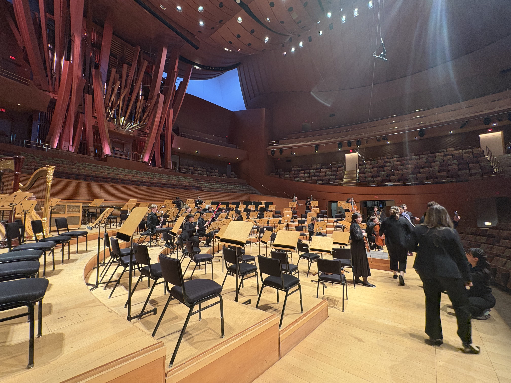
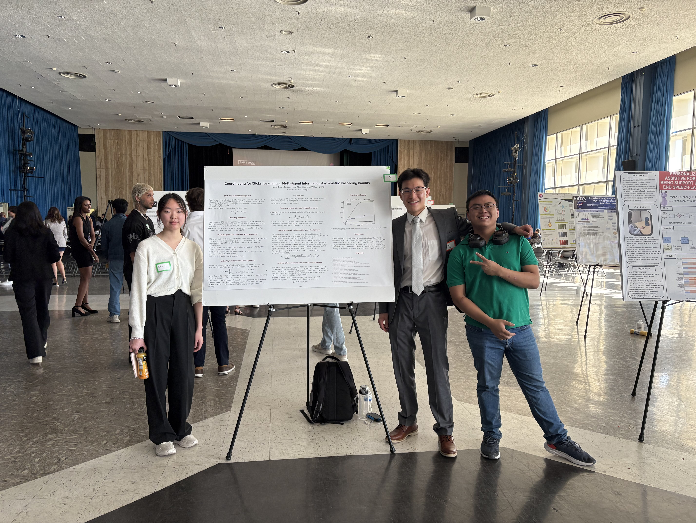
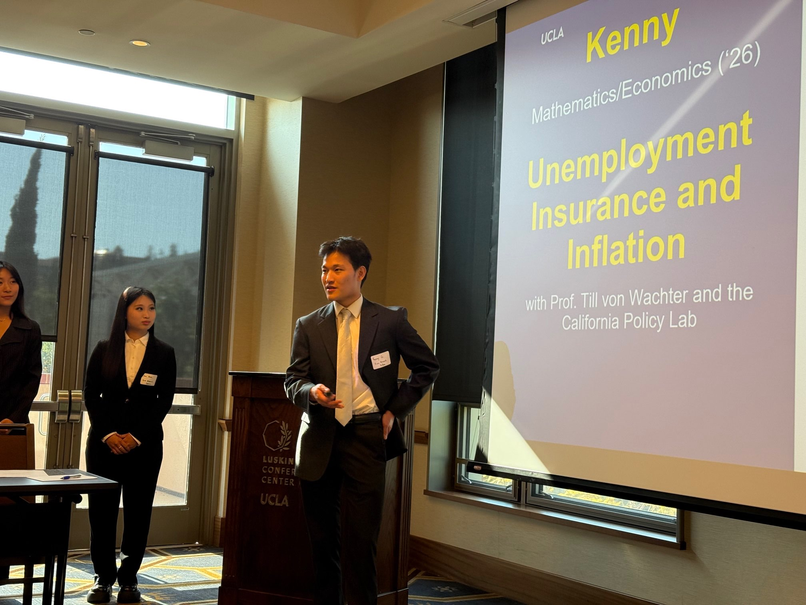

---

## Blogs

### 2026

::: {.event-list}

- 

  
Applying for Economics Ph.D. Programs · March 24, 2026 Expand

  I wrote about my experience applying to Economics Ph.D. programs [here](blog/economics-phd-applications/econphdapp.qmd){target="_blank"}.

  

- 

  
My Experience at LAHacks · April 26, 2026 Expand

  I wrote about my experience attending my first hackathon as a math/economics major [here](blog/lahacks-2026/lahacks.qmd){target="_blank"}.

  

- 

  
A Note on AI Conferences · September 25, 2026 Expand

  My reflections on the NeurIPS 2026 cycle and general research philosophies: [read here](blog/note-on-ai-confs/ai-confs.qmd){target="_blank"}.

  

- 

  
Starting Yale · September 26, 2026 Expand

  My reflections on the first two months as a Yale Economics PhD student: [read here](blog/starting-yale/starting-yale.qmd){target="_blank"}.

  

:::

### 2025

::: {.event-list}

- 

  
[Mahlerthon at Walt Disney Concert Hall](https://www.laphil.com/events/performances/3544/2025-03-02/mahlerthon-part-two){target="_blank"} · March 2, 2025 Expand

  During Winter 2025, [UCLA Philharmonia](https://www.laphil.com/musicdb/artists/5418/ucla-philharmonia){target="_blank"}, along with USC Thornton and Colburn, was invited to perform as part of the LA Phil's *Mahlerthon*.

  I was fortunate enough to play first violin in Mahler's Symphony No. 6 — big hammer included.

  

  

- 

  
Southern California AI Research Showcase 2025 (SAIRS) · April 19, 2025 Expand

  My friend Helen and I presented some of our recent work on multi-agent multi-armed bandits at a UCLA AI conference.

  This was my first poster presentation, and it was great getting to talk with everyone from CS faculty to incoming UCLA first-years. I hope they found our work at least an $\epsilon$ margin from boring.

  

  

- 

  
Economics Board of Visitors Meeting · April 28, 2025 Expand

  During my final year at UCLA, I was fortunate to be funded by the UCLA Economics Board of Visitors' Economics Research Fellowship.

  Through the program, I conducted research with Professor Till von Wachter and the California Policy Lab on the Unemployment Insurance program and presented a snapshot of our work to the Board.

  I met some really cool people through the program and learned a lot more about the different paths one can take in economics.

  

  

- 

  
Summer at NERA and New York City · Summer 2025 Expand

  During Summer 2025, I interned at National Economic Research Associates (NERA) in New York City in the Securities and Finance practice.

  I wrote more about my experience [here](blog/nera-new-york/nera-ny.qmd){target="_blank"}.

  

:::

---

## Misc.

::: {.event-list}

- 

  
UCLA Course Materials Expand

  If you're a current UCLA math or econ student, I maintain an archive of some of my classwork and solutions [here](ucla.qmd).

  

:::

::: {.event-list}

- 

  
ScreenSketch Expand

  Sketching tool. I think it's pretty easy-to-use, works with Sidecar Mirroring with an iPad and Apple Pencil, and would be helpful if you do research with others online or just want a general sketching tool to draw over your screen(s). Find the download [here](https://github.com/kguo12/ScreenSketch){target="_blank"}.

  

:::

